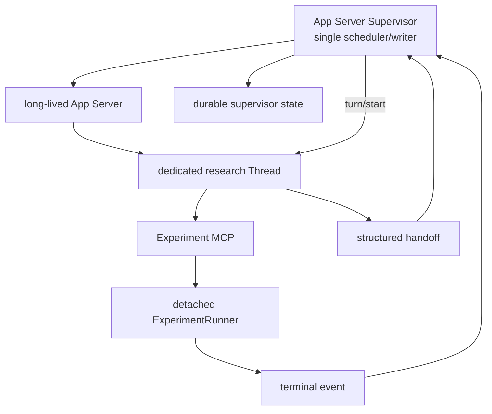

# Auto Research Agent

`main` 是 v0.4 App Server Supervisor：Codex 负责研究判断，Supervisor 作为专用
research task 的唯一 writer，显式创建 Turn；detached Worker 在 Turn 之外执行长实验。

旧的 one-shot Goal Listener 已冻结在 `listener` 分支。真实验证表明，跨宿主把
Goal 写成 `active` 并不能保证 Desktop scheduler 创建 continuation Turn，因此它
不再是 `main` 的自动闭环基础。

## 架构



核心边界：

- App Server 的 `turn/start` 才会确定性地启动一次生成；`thread/goal/set(active)`、
  `thread/resume`、`thread/inject_items` 都不等价于创建 Turn。
- 一个项目只有一个 Supervisor lock、一个专用 Thread writer、默认一个活动实验。
- Turn 结束前必须通过 MCP 提交结构化 handoff；Supervisor 不解析自然语言猜状态。
- `WAIT_FOR_RUN` 后只等待本地终态文件，不运行模型，也不轮询 MCP。
- Supervisor Thread 不启动 Listener；非 Supervisor 调用仍保留旧 Listener 兼容路径。

详细设计见 [App Server Supervisor](docs/AUTO_RESEARCH_SUPERVISOR_SCHEDULER_DESIGN.md)，
Codex 状态与宿主边界见 [Codex 概念与功能边界](docs/CODEX_GOAL_CONCEPTS_AND_CAPABILITY_BOUNDARIES.md)。

## 安装与初始化

```bash
uv venv
uv sync --extra mcp --extra watcher
uv run auto-research init /path/to/experiment-project
uv run auto-research register-mcp --project /path/to/experiment-project
```

`goal.json.statement` 是专用 task 的初始 objective。首次启动时 Supervisor 会幂等
创建 `research/codex_session.json`；已有绑定则复用并校验项目 `cwd`。

## 启动 Supervisor

后台启动：

```bash
uv run auto-research supervisor start --project /path/to/experiment-project
```

前台诊断：

```bash
uv run auto-research supervisor run --project /path/to/experiment-project
```

状态与人工恢复：

```bash
uv run auto-research supervisor status --project /path/to/experiment-project
uv run auto-research supervisor resume --project /path/to/experiment-project
```

`resume` 只把 `NEEDS_USER`、`HANDOFF_UNCONFIRMED`、`RECOVERY_ERROR` 人工停点
恢复为 `TURN_READY`，不会伪造实验结果或重复提交 Turn。

持久控制状态位于：

```text
research/supervisor/
├── state.json
├── active_turn.json
├── handoffs/<turn_attempt_id>.json
├── process.json
└── supervisor.log
```

## Codex Turn 的控制协议

每次 Turn 的提示中含唯一 `turn_attempt_id`。结束前必须调用
`submit_supervisor_handoff`：

| action | 含义 |
|---|---|
| `WAIT_FOR_RUN` | 已启动 detached run；等待指定 `run_id` 终态 |
| `CONTINUE_NOW` | 不等待实验，立即再开一个 Turn；最多连续一次 |
| `NEEDS_USER` | 缺少用户决策、授权或外部输入 |
| `COMPLETE` | 整个研究目标已达成并有证据 |
| `FAILED_STOP` | 没有安全恢复路径 |

MCP 同时提供 `start_experiment`、`get_experiment_result`、
`cancel_experiment`。Supervisor 模式下 `start_experiment` 返回
`scheduler=app_server_supervisor` 和 `wake_listener.status=DISABLED`。

## 安全与恢复

- Supervisor 用非阻塞文件锁拒绝第二个 scheduler。
- `turn_attempt_id` 与 handoff 文件一一对应，重复但不同的 handoff 会失败。
- `run_id` 必须归属当前 Supervisor Thread，才能进入等待。
- 实验终态先原子持久化，再进入分析 Turn。
- Turn 无 handoff 时进入 `HANDOFF_UNCONFIRMED`，不会自动空转。
- App Server approval/user-input 请求默认拒绝或取消；不会静默扩大权限。
- Desktop 可查看专用 task 历史，但 Supervisor 运行时不应同时向该 task 发起 Turn。

## 历史版本

| 版本 | Git 位置 | 方案 |
|---|---|---|
| v0.1.0 | tag `v0.1.0` | 完整 Goal Harness |
| v0.2.0 | tag `v0.2.0` | Codex 自主研究 + 生命周期 Harness |
| v0.3 | branch `listener` | one-shot Goal Wake Listener |
| v0.4 | `main` | single-writer App Server Supervisor |

## 验证

```bash
uv run --with pytest pytest -q
```

官方协议参考：[App Server lifecycle](https://learn.chatgpt.com/docs/app-server#lifecycle-overview)、
[Turns](https://learn.chatgpt.com/docs/app-server#turns)。
