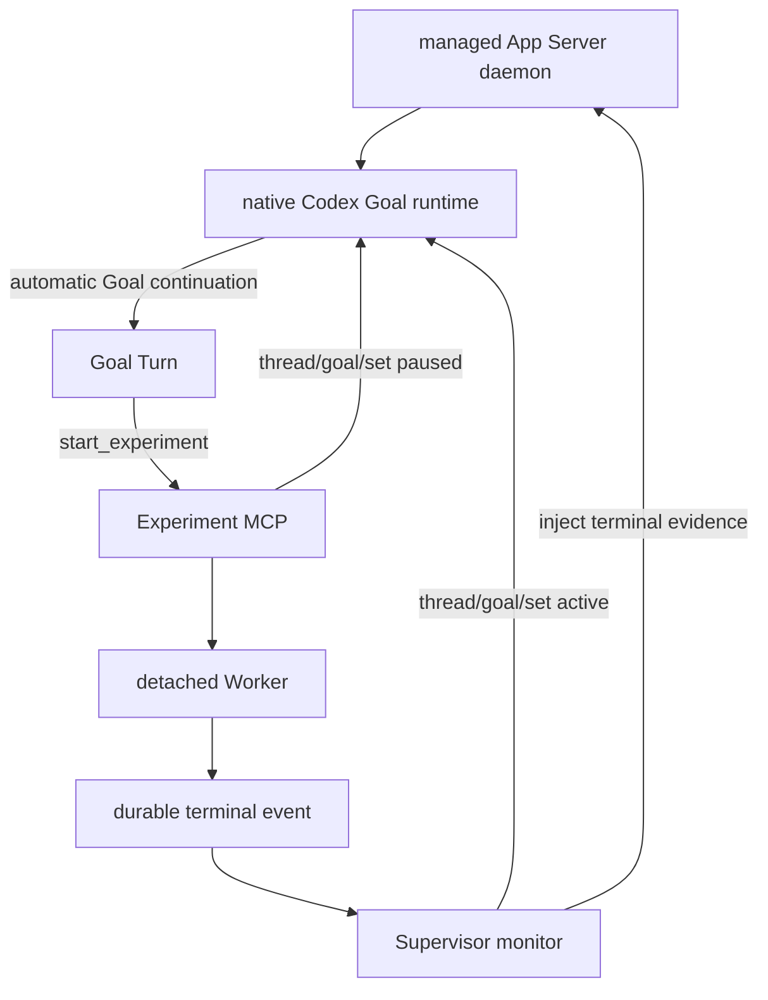

# Auto Research Agent

`main` 是 v0.5：由单一 managed App Server daemon 的原生 Goal runtime 执行长期
研究；Supervisor 只监控 detached 实验并控制 Goal 的 `paused → active` 交接。
它不依赖 Desktop，也不调用 `turn/start` 创建普通 continuation。

## 架构



核心不变量：

- 只有 App Server Goal runtime 创建研究 continuation。
- Supervisor 从不调用 `turn/start`。
- 实验启动工具在当前 Goal Turn 结束前同步设置 Goal `paused`。
- 实验期间仅 Worker 和本地 Supervisor 运行，不消耗模型 token。
- 实验终态先持久化，再注入证据并设置 Goal `active`。
- 必须收到自动 `turn/started`，才算 Goal 真正恢复。
- 所有客户端连接同一个 managed daemon；不得为同一 Goal 启动第二个独立
  `codex app-server --stdio` 进程。

详细设计见 [Goal Runtime Supervisor](docs/AUTO_RESEARCH_SUPERVISOR_SCHEDULER_DESIGN.md)，
状态与宿主边界见 [Codex 概念文档](docs/CODEX_GOAL_CONCEPTS_AND_CAPABILITY_BOUNDARIES.md)。

## 安装

```bash
uv venv
uv sync --extra mcp --extra watcher
uv run auto-research init /path/to/project
uv run auto-research register-mcp --project /path/to/project
```

本机 Codex 必须启用 `goals`：

```bash
codex features list | grep goals
```

当前支持版本应显示 `stable true`。Supervisor 和 session bootstrap 会幂等启动：

```bash
codex app-server daemon start
```

客户端读取 lifecycle 返回的 `socketPath`，通过该 Unix socket 上的 WebSocket
直接连接同一 daemon。连接必须关闭 per-message compression；当前 Codex daemon
会拒绝带该扩展的握手。`codex app-server proxy` 是 WebSocket 字节代理，不是 JSONL
代理，因此本项目不把 JSONL 直接写入它。

## 启动

后台运行：

```bash
uv run auto-research supervisor start --project /path/to/project
```

默认创建并复用 `research/supervisor_session.json` 绑定的独立 App Server Thread，
不会接管 `research/codex_session.json` 中已有的 Desktop/旧 Listener 会话。只有明确
需要接管时才使用：

```bash
uv run auto-research supervisor start --project /path/to/project --adopt-session
```

前台诊断：

```bash
uv run auto-research supervisor run --project /path/to/project
```

状态与人工恢复：

```bash
uv run auto-research supervisor status --project /path/to/project
uv run auto-research supervisor resume --project /path/to/project
```

`resume` 只允许用于 `NEEDS_USER` / `RECOVERY_ERROR`，会重置持久状态并重新启动
detached Supervisor；它不是向 Thread 发送 `/goal resume` 文本。

首次运行会幂等创建 Supervisor 专用 Thread 和 Goal。Goal 初始 `paused`；Supervisor连接
managed daemon 后设置 `active`，由 Goal runtime 自动产生第一个 continuation。

## 实验交接

Goal Turn 调用 `start_experiment` 后，返回：

```json
{
  "run_id": "run-idea-001-ab12cd34",
  "status": "RUNNING",
  "scheduler": "app_server_goal_runtime",
  "goal_pause": {"status": "PAUSED"},
  "wake_listener": {"status": "DISABLED"}
}
```

`goal_pause.status` 必须为 `PAUSED`，Goal Turn 才应结束。终态后 Supervisor 将
结果作为不可信外部事件注入 Thread 历史，再设置 Goal `active`。Goal runtime 的
下一 continuation 可以直接读取 run 路径、状态、日志尾部和 metrics。

## 持久状态

```text
research/
├── codex_session.json
├── supervisor_session.json
├── active_experiment.json
├── supervisor/
│   ├── state.json
│   ├── experiment_handoff.json
│   ├── process.json
│   └── supervisor.log
└── runs/<run_id>/
    ├── run.json
    ├── heartbeat.json
    ├── metrics.json
    └── events/<terminal>.json
```

## 安全与恢复

- 项目级非阻塞锁保证一个 Supervisor monitor。
- managed daemon 是 Goal runtime 的唯一进程 owner。
- 多个 WebSocket connection 可以共享 daemon，但不能启动多个独立 App Server 进程
  恢复同一个 active Goal。
- Supervisor 重启时若发现 `active_experiment.json`，会在 `thread/resume` 前先把
  Goal 设为 `paused`，防止恢复动作提前创建 continuation。
- Goal `blocked`、`usageLimited`、`budgetLimited` 进入 `NEEDS_USER`。
- Goal `complete` 结束 Supervisor。
- approval/user-input 请求不会被 Supervisor 静默批准。
- 专用研究 Thread 不应同时在 Desktop 的另一个 App Server host 中恢复。

## 版本

| 版本 | Git 位置 | 方案 |
|---|---|---|
| v0.1.0 | tag `v0.1.0` | 完整 Goal Harness |
| v0.2.0 | tag `v0.2.0` | Codex + 生命周期 Harness |
| v0.3 | branch `listener` | Desktop Goal wake Listener |
| v0.4 | commit `669990f` | Supervisor 显式 `turn/start` 原型 |
| v0.5 | `main` | managed App Server native Goal runtime |

## 验证

```bash
uv run --with pytest pytest -q
```

参考：[App Server README](https://github.com/openai/codex/blob/main/codex-rs/app-server/README.md)、
[Goal runtime](https://github.com/openai/codex/blob/main/codex-rs/ext/goal/src/runtime.rs)。
