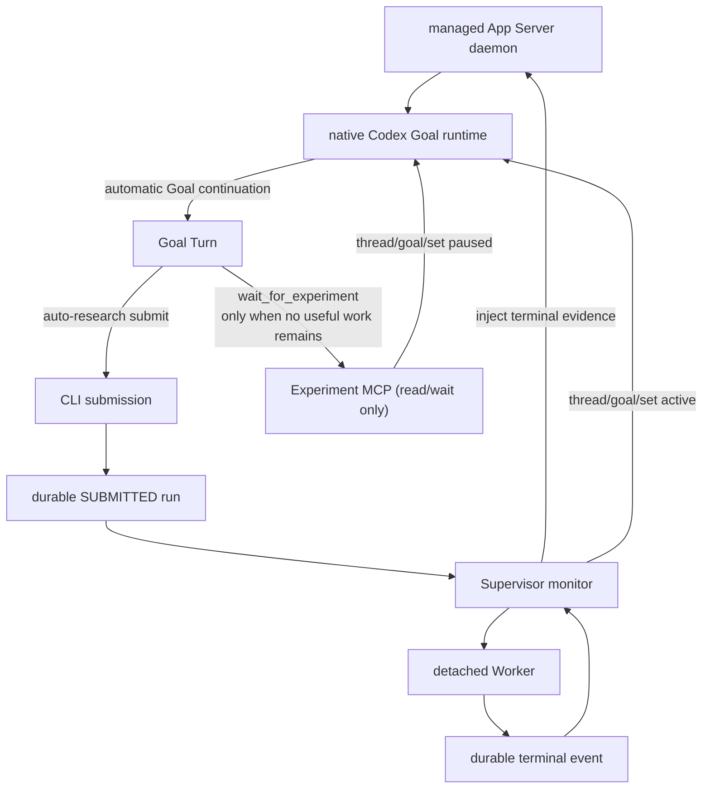

# Auto Research Agent

`main` 是 v0.5：由单一 managed App Server daemon 的原生 Goal runtime 执行长期
研究；Supervisor 独占 detached Worker 的启动和监控，并在 Agent 明确进入纯等待阶段
后控制 Goal 的 `paused → active` 交接。
它不依赖 Desktop，也不调用 `turn/start` 创建普通 continuation。

## 架构



核心不变量：

- 只有 App Server Goal runtime 创建研究 continuation。
- Supervisor 从不调用 `turn/start`。
- `auto-research submit` 只持久化 Codex 生成的命令，不直接创建进程；Supervisor 是唯一
  Worker 启动者。
- 提交实验不暂停 Goal；实验运行期间允许原生 continuation 继续分析、
  检查稳定性和设计后续方案。
- 只有 Agent 判断除等待终态外已无有效工作时，才调用 `wait_for_experiment` 同步
  设置 Goal `paused`。
- 实验终态先持久化，再注入证据并设置 Goal `active`。
- 必须收到自动 `turn/started`，才算 Goal 真正恢复。
- 所有客户端连接同一个 managed daemon；不得为同一 Goal 启动第二个独立
  `codex app-server --stdio` 进程。

详细设计见 [Goal Runtime Supervisor](docs/AUTO_RESEARCH_SUPERVISOR_SCHEDULER_DESIGN.md)，
正式 Goal 提示词见 [Supervisor Goal Prompt](docs/CODEX_GOAL_PROMPT.md)，状态与宿主
边界见 [Codex 概念文档](docs/CODEX_GOAL_CONCEPTS_AND_CAPABILITY_BOUNDARIES.md)。

## 安装

```bash
uv venv
uv sync --extra mcp --extra watcher
uv run auto-research init /path/to/project
uv run auto-research register-mcp --project /path/to/project
```

`research/config.toml` 必须显式固定 Supervisor 使用的 Codex 模型：

```toml
[codex]
model = "gpt-5.6-terra"
approval_policy = "never"
sandbox = "workspace-write"
```

该配置只用于创建或恢复 App Server task。Supervisor 不会以模型可用性或 Goal 状态
作为已提交实验的启动、监控或终态回传门槛。

本机 Codex 必须启用 `goals`：

```bash
codex features list | grep goals
```

当前支持版本应显示 `stable true`。Supervisor 和 session bootstrap 会幂等启动：

```bash
codex app-server daemon start
```

客户端读取 lifecycle 返回的 `socketPath`，通过该 Unix socket 上的 WebSocket
直接连接同一 daemon。连接必须关闭 per-message compression；当前 Codex daemon
会拒绝带该扩展的握手。`codex app-server proxy` 是 WebSocket 字节代理，不是 JSONL
代理，因此本项目不把 JSONL 直接写入它。

## 启动

后台运行：

```bash
uv run auto-research supervisor start --project /path/to/project
```

默认 `session-mode=auto`，会从同一个 state root 自动选择唯一绑定：

- 已有 `codex_session.json`：复用 `session --create-thread` 创建的 Thread；
- 已有 `supervisor_session.json`：复用 Supervisor 自己创建的 Thread；
- 两者都不存在：创建 `supervisor_session.json` 和独立 Thread；
- 两者同时存在且没有已持久化的 controller mode：拒绝启动，不会静默创建副本。

因此下面的顺序不需要额外模式参数：

```bash
uv run auto-research session --project /path/to/project --state-root research/supervisors/run-a --create-thread --objective "..."
uv run auto-research supervisor start --project /path/to/project --state-root research/supervisors/run-a
```

只有处理历史歧义目录时才显式传
`--session-mode adopted` 或 `--session-mode dedicated`。模式会写入 Supervisor state，
后续 `start`、`resume` 和 `restart` 自动沿用。

Thread 选择本质上只有“新建”和“复用已有”两种；“复用当前会话”只是复用已有
Thread 的一种来源，不是第三种模式。完整的绑定、歧义和恢复规则见
[Supervisor 会话选择机制](docs/AUTO_RESEARCH_SUPERVISOR_SCHEDULER_DESIGN.md#31-supervisor-会话选择机制)。

前台诊断：

```bash
uv run auto-research supervisor run --project /path/to/project
```

状态与人工恢复：

```bash
uv run auto-research supervisor status --project /path/to/project
uv run auto-research supervisor resume --project /path/to/project
```

`resume` 只允许用于 `NEEDS_USER` / `RECOVERY_ERROR`，会重置持久状态并重新启动
detached Supervisor；它不是向 Thread 发送 `/goal resume` 文本。

已完成的 Goal 若要在**同一 Thread**上开始下一轮研究，必须显式提供新的目标：

```bash
uv run auto-research supervisor restart --project /path/to/project \
  --objective "new research objective"
```

`restart` 复用 `supervisor_session.json` 的 Thread 和历史上下文，但替换旧 Goal；普通
`start` 不会重放已完成的 Goal。

首次运行会幂等创建 Supervisor 专用 Thread 和 Goal。Goal 初始 `paused`；Supervisor连接
managed daemon 后设置 `active`，由 Goal runtime 自动产生第一个 continuation。

## 实验交接

Goal Turn 生成实验命令并调用 `auto-research submit` 后，返回：

```json
{
  "run_id": "run-idea-001-ab12cd34",
  "status": "SUBMITTED",
  "scheduler": "app_server_supervisor",
  "worker_owner": "supervisor",
  "goal_pause": {"status": "NOT_REQUESTED", "continuation_allowed": true}
}
```

Supervisor 随后把该 run 从 `SUBMITTED` 转为 `RUNNING` 并持有 Worker。Codex 不得用
shell、`setsid` 或其他工具绕过 Supervisor 直接启动长实验。此时 Goal 保持 active；
Agent 可以继续有价值的研究。只有工作清单只剩等待时才调用
`wait_for_experiment(run_id)`。该工具返回 `wait_handoff=PAUSED` 后结束 Turn。终态后
Supervisor 将结果作为不可信外部事件注入 Thread 历史，再设置 Goal `active`。

## 持久状态

```text
research/
├── supervisor_session.json
├── supervisor/
│   ├── state.json
│   ├── active_experiment.json
│   ├── experiment_handoff.json
│   ├── process.json
│   └── supervisor.log
└── runs/<run_id>/
    ├── run.json
    ├── heartbeat.json
    ├── metrics.json
    └── events/<terminal>.json
```

## 安全与恢复

- 项目级非阻塞锁保证一个 Supervisor monitor。
- Supervisor-owned run 只使用 `research/supervisor/active_experiment.json`，内部严格
  一次只运行一个实验。
- managed daemon 是 Goal runtime 的唯一进程 owner。
- 多个 WebSocket connection 可以共享 daemon，但不能启动多个独立 App Server 进程
  恢复同一个 active Goal。
- Supervisor 重启时若发现 `active_experiment.json`，会在 `thread/resume` 前先把
  Goal 设为 `paused`，防止恢复动作提前创建 continuation。
- Goal `blocked`、`usageLimited`、`budgetLimited` 会令后续 Codex Turn 进入
  `NEEDS_USER`；但已启动 Worker 仍被监控到终态，终态会清 marker、注入证据并尝试
  唤醒 Goal。
- Goal `complete` 结束 Supervisor。
- approval/user-input 请求不会被 Supervisor 静默批准；实验提交默认不走 MCP。

## Deferred: MCP automatic approval

默认提交入口是 `auto-research submit` CLI。当前不向 Goal 暴露写入型
`submit_experiment` MCP 工具，避免 App Server 的 `tool/requestUserInput` 变成不稳定的
人为确认点。

后续如确有必须通过 MCP 提交的场景，再实现**严格白名单**的自动批准：只接受本项目、
绑定的 Supervisor Thread、受限的 `submit_experiment` 参数和经过校验的命令。它不得以
`danger-full-access` 作为绕过确认的方式，也不得批准其他 MCP 工具。实现前保持 CLI 为
唯一默认入口。
- 专用研究 Thread 不应同时在 Desktop 的另一个 App Server host 中恢复。

## Legacy Desktop Listener（默认禁用）

`main` 仅为已有 Desktop Goal 任务保留 one-shot Listener 兼容代码。它不是 Supervisor
的组成部分，新项目 `listener.auto_wake=false`，`recover-wakes` 也不会在禁用状态下
重新启动 Listener。只有维护既有任务时才显式设置：

```toml
[listener]
auto_wake = true # legacy Desktop compatibility only
```

对应 CLI `arm-wake`、`recover-wakes` 均为 legacy 命令。完整状态机、`blocked_wait`
约定和恢复边界只在
[Legacy Desktop Goal Wake Listener](docs/LEGACY_DESKTOP_GOAL_WAKE_LISTENER.md) 中维护，
不会写入 Supervisor 正式设计或 Goal 提示词。

## 版本

| 版本 | Git 位置 | 方案 |
|---|---|---|
| v0.1.0 | tag `v0.1.0` | 完整 Goal Harness |
| v0.2.0 | tag `v0.2.0` | Codex + 生命周期 Harness |
| v0.3 | branch `listener` / main legacy opt-in | Desktop Goal wake Listener |
| v0.4 | commit `669990f` | Supervisor 显式 `turn/start` 原型 |
| v0.5 | `main` | managed App Server native Goal runtime |

## 验证

```bash
uv run --with pytest pytest -q
```

参考：[App Server README](https://github.com/openai/codex/blob/main/codex-rs/app-server/README.md)、
[Goal runtime](https://github.com/openai/codex/blob/main/codex-rs/ext/goal/src/runtime.rs)。
