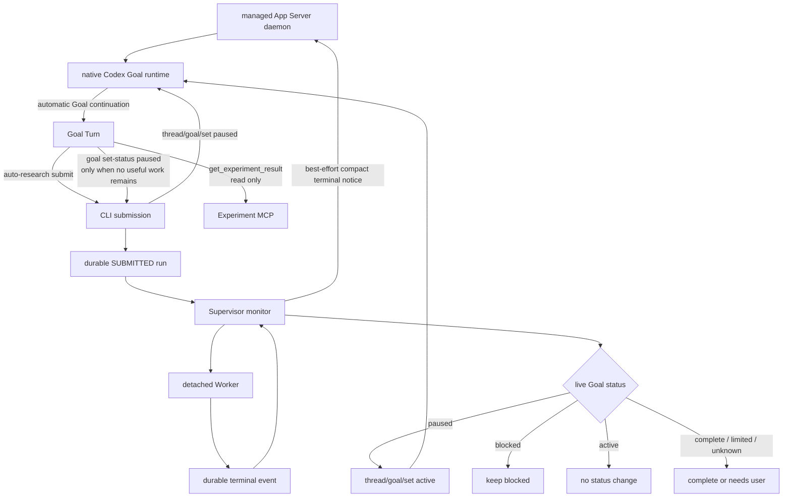

# Auto Research Agent

`main` 是 v0.5：由单一 managed App Server daemon 的原生 Goal runtime 执行长期
研究；Supervisor 独占 detached Worker 的启动和监控，并在 Agent 明确进入纯等待阶段
后控制 Goal 的 `paused → active` 交接。
它不依赖 Desktop，也不调用 `turn/start` 创建普通 continuation。

## 架构



核心不变量：

- 只有 App Server Goal runtime 创建研究 continuation。
- Supervisor 不用 `turn/start` 创建正常 continuation；只有 native 激活失败后的单次、
  可审计 repair fallback 可以调用它。
- `auto-research submit` 只持久化 Codex 生成的命令，不直接创建进程；Supervisor 是唯一
  Worker 启动者。
- 提交实验不暂停 Goal；实验运行期间允许原生 continuation 继续分析、
  检查稳定性和设计后续方案。
- 只有 Agent 判断除等待终态外已无有效工作时，才调用
  `auto-research goal set-status paused` 设置 Goal `paused`。
- “Agent 自主暂停”表示 Agent 自主决定并调用 Auto Research 状态桥；模型本身没有原生
  `thread/goal/set(paused)` 工具。
- Experiment MCP 保留无需人工授权的 `get_experiment_result` 和
  `cancel_experiment`；两者都不修改 Goal，也不消费 Supervisor 的终态交付记录。
  当前不提供 MCP `wait_for_experiment`。CLI `auto-research wait` 是不修改 Goal 的同步
  观察入口，可以与状态桥共存；长实验默认仍使用 paused→active 闭环。
- 实验终态先持久化，再尽力注入只含 `run_id/status/result_dir` 的轻量通知；注入失败不
  阻断恢复。只有实时 `paused` Goal 才设置为 `active`，实时 `blocked` 永不自动恢复。
- 必须收到自动 `turn/started`，才算 Goal 真正恢复。
- 所有客户端连接同一个 managed daemon；不得为同一 Goal 启动第二个独立
  `codex app-server --stdio` 进程。

详细设计见 [Goal Runtime Supervisor](docs/AUTO_RESEARCH_SUPERVISOR_SCHEDULER_DESIGN.md)，
最高层约束见 [Auto Research 设计原则](docs/DESIGN_PRINCIPLES.md)，
正式 Goal 提示词见 [Supervisor Goal Prompt](docs/CODEX_GOAL_PROMPT.md)，状态与宿主
边界见 [Codex 概念文档](docs/CODEX_GOAL_CONCEPTS_AND_CAPABILITY_BOUNDARIES.md)。

## 安装

```bash
uv venv
uv sync --extra mcp --extra watcher
uv run auto-research init /path/to/project
uv run auto-research register-mcp --project /path/to/project
```

项目根目录的 `GOAL.md` 是原生 Codex Goal 的唯一目标来源。`init` 会在缺失时创建
模板；`session` 和 Supervisor 首次创建 Thread 时读取全文并原样写入 Goal。
实验提交只记录该文件内容的 SHA-256 快照用于审计，不从旧 JSON 文件解析或执行
流程限制。

`research/config.toml` 必须显式固定 Supervisor 使用的 Codex 模型：

```toml
[codex]
model = "gpt-5.6-terra"
approval_policy = "never"
sandbox = "workspace-write"
```

该配置只用于创建或恢复 App Server task。Supervisor 不会以模型可用性或 Goal 状态
作为已提交实验的启动、监控或终态回传门槛。

本机 Codex 必须启用 `goals`：

```bash
codex features list | grep goals
```

当前支持版本应显示 `stable true`。Supervisor 和 session bootstrap 会幂等启动：

```bash
codex app-server daemon start
```

客户端读取 lifecycle 返回的 `socketPath`，通过该 Unix socket 上的 WebSocket
直接连接同一 daemon。连接必须关闭 per-message compression；当前 Codex daemon
会拒绝带该扩展的握手。`codex app-server proxy` 是 WebSocket 字节代理，不是 JSONL
代理，因此本项目不把 JSONL 直接写入它。

## 启动

后台运行：

```bash
uv run auto-research session --project /path/to/project --create-thread \
  --creation-key <stable-request-id> --objective "..."
# 复制上一条输出的 thread_id
uv run auto-research supervisor start --project /path/to/project --thread-id <thread-id>
```

状态目录不再由调用者命名，而是固定为
`research/supervisors/<thread-id>/`。`session --create-thread` 要求稳定的
`--creation-key`；独立 CLI 重试会复用同一创建记录，未完成的创建失败关闭而不会静默
生成第二个 Thread。取得 App Server
Thread ID，再立即原子写入该目录的 `supervisor_session.json`。之后所有命令只接受
Thread ID，不搜索标题、最近会话或其他状态目录。

复用已有 Thread 时直接绑定它：

```bash
uv run auto-research session --project /path/to/project --thread-id <thread-id> --objective "..."
uv run auto-research supervisor start --project /path/to/project --thread-id <thread-id>
```

Thread 选择本质上只有“新建”和“复用已有”两种；“复用当前会话”只是复用已有
Thread 的一种来源，不是第三种模式。完整的绑定、歧义和恢复规则见
[Supervisor 会话选择机制](docs/AUTO_RESEARCH_SUPERVISOR_SCHEDULER_DESIGN.md#31-supervisor-会话选择机制)。

前台诊断：

```bash
uv run auto-research supervisor run --project /path/to/project --thread-id <thread-id>
```

状态与人工恢复：

```bash
uv run auto-research supervisor status --project /path/to/project --thread-id <thread-id>
uv run auto-research supervisor resume --project /path/to/project --thread-id <thread-id>
```

`resume` 只允许用于 `NEEDS_USER`，会重置持久状态并重新启动 detached Supervisor；
普通 `start` 也允许对尚未完成的控制器做一次显式重试。二者都不是向 Thread 发送
`/goal resume` 文本，也不得形成后台自动重启循环。

已完成的 Goal 若要在**同一 Thread**上开始下一轮研究，必须显式提供新的目标：

```bash
uv run auto-research supervisor restart --project /path/to/project \
  --thread-id <thread-id> \
  --objective "new research objective"
```

`restart` 复用 `supervisor_session.json` 的 Thread 和历史上下文，但替换旧 Goal；普通
`start` 不会重放已完成的 Goal。

首次运行会幂等创建 Supervisor 专用 Thread 和 Goal。Goal 初始 `paused`；Supervisor连接
managed daemon 后设置 `active`，由 Goal runtime 自动产生第一个 continuation。

## 实验交接

Goal Turn 生成实验命令并调用 `auto-research submit` 后，返回：

```json
{
  "run_id": "run-idea-001-ab12cd34",
  "status": "SUBMITTED",
  "scheduler": "app_server_supervisor",
  "worker_owner": "supervisor",
  "goal_pause": {"status": "NOT_REQUESTED", "continuation_allowed": true}
}
```

Supervisor 随后把该 run 从 `SUBMITTED` 转为 `RUNNING` 并持有 Worker。Codex 不得用
shell、`setsid` 或其他工具绕过 Supervisor 直接启动长实验。此时 Goal 保持 active；
Agent 可以继续有价值的研究。只有工作清单只剩等待时才调用
`auto-research goal set-status paused`，确认返回 `paused` 或
`PENDING_SUPERVISOR` 后结束 Turn。Experiment MCP 可用于非循环查询和取消，但不参与
Goal 状态控制。`auto-research wait` 也只等待 durable terminal event，不写 Goal；它可用于
短时同步等待或诊断，不是第二套 Goal 控制面。终态后 Supervisor 先将结果作为不可信
外部事件注入 Thread 历史；只有 Goal 实时状态为 `paused` 时才设置 `active`。
`blocked` 表示真实阻塞，实验终态不会覆盖。

`submit` 可选传入 `--gpu-ids 0,1,2,3` 和重复的 `--expected-artifact <path>`。它们是
可观测性元数据，不构成 Supervisor 的并发限制。Worker 将命令退出码与
`artifact_validation.json` 分开报告；进程成功但缺少 metrics/预期产物时仍把错误交给
Codex 分析，不由 Supervisor 冒充业务失败或成功。

提交接受任意存在的 worktree 和正数 timeout，不限制 worktree 必须位于项目内，不设置
七天上限，也不维护 executable allowlist。命令内容由 Codex 负责，Supervisor 只保证其
durable ownership、进程边界和终态收尾。

## 持久状态

```text
research/
└── supervisors/<thread-id>/
    ├── metadata.json
    ├── supervisor_session.json
    ├── cycles/<cycle-id>.json
    ├── supervisor/
    │   ├── state.json
    │   ├── active_experiments.json
    │   ├── process.json
    │   ├── goal_status_requests/<request-id>.json
    │   ├── goal_status_acks/<request-id>.json
    │   └── supervisor.log
    └── runs/<run-id>/
        ├── run.json
        ├── heartbeat.json
        ├── metrics.json
        └── events/<terminal>.json
```

## 安全与恢复

- Thread 级非阻塞锁保证一个 Supervisor monitor。
- `research/supervisors/<thread-id>/supervisor/active_experiments.json` 按 `run_id` 保存所有待启动、运行中或
  待交付终态的 run。Supervisor 不限制并发数量；串行偏好可以写在 `GOAL.md`。
- managed daemon 是 Goal runtime 的唯一进程 owner。
- 多个 WebSocket connection 可以共享 daemon，但不能启动多个独立 App Server 进程
  恢复同一个 active Goal。
- Supervisor 重启时若发现等待中的活动 run，只会在实时 Goal 为 `active` 时于
  `thread/resume` 前先设为 `paused`，防止恢复动作提前创建 continuation；已经
  `paused` 或 `blocked` 的 Goal 保持不变。
- `submit` 在持久化 run 后验证 Supervisor 进程；进程不存在时自动启动，并等待 session、
  daemon、registry 与 Worker reconciliation 完成后发布 `OPERATIONAL`。启动失败时仍返回
  已持久化的 run id 和 `REPAIR_PENDING`，避免重复提交。
- Goal Turn 自主进入 `blocked` 或无实验的 `paused` 后，Supervisor 尊重该状态并停止
  创建 continuation；不得把普通非 active 状态当成唤醒故障。若已有 Worker，仍监控到
  终态。终态通知为 best effort；paused Goal 只唤醒一次，blocked Goal 保持 blocked。`usageLimited`、
  `budgetLimited` 进入 `NEEDS_USER`。Supervisor 不轮询额度、不定时自动恢复；用户恢复
  额度后手动执行 `supervisor start` 或 `supervisor resume`，只尝试一次 Goal 激活，失败
  就重新退出。实验终态已经成功注入时，不要求为了额度恢复长期保留 run marker。
- Goal `complete` 结束 Supervisor。
- approval/user-input 请求不会被 Supervisor 静默批准；实验提交默认不走 MCP。
- Supervisor 重启会从 Thread root 重建缺失的 active-run ownership。只有确认 Worker
  已退出且 child 已安全收尾才写 `LOST`；身份无法核验或清理失败时进入修复路径，不伪造
  `CANCELLED/LOST`。
- `NEEDS_USER` 只暂停没有新终态依据的 Goal 自动推进，不暂停实验控制面；已提交的 run
  仍会启动并监控到终态，终态仍会尝试唤醒实时 paused Goal。Worker 超过 deadline 时，
  只有核验并清理 Worker/child 后才写 `TIMEOUT`。
- Goal Turn 默认允许最多 1800 秒无可观察进展；Turn 快照变化会刷新期限，因此正常长任务
  不会仅因总运行时间被中断。持续无进展会中断并创建一次 repair Turn；repair Turn 再次
  无进展直接进入 `NEEDS_USER`，不会递归生成 Turn。repair 失败也不停止已有实验监控，
  终态恢复创建的 repair Turn 会重新接入同一个 watchdog。

容错目标是避免无限自动循环、永久停滞和失控进程，不追求跨进程严格 exactly-once。
单个残留请求导致一次额外 Goal 激活、一次额外 continuation 或一次重复终态注入可以接受；
它们不得自行持续发生。只有确认 Worker/child 已退出后，才能把取消或 LOST 写成终态。

## Deferred: MCP automatic approval

默认提交入口是 `auto-research submit` CLI。当前不向 Goal 暴露写入型
`submit_experiment` MCP 工具，避免 App Server 的 `tool/requestUserInput` 变成不稳定的
人为确认点。

后续如确有必须通过 MCP 提交的场景，再实现**严格白名单**的自动批准：只接受本项目、
绑定的 Supervisor Thread、受限的 `submit_experiment` 参数和经过校验的命令。它不得以
`danger-full-access` 作为绕过确认的方式，也不得批准其他 MCP 工具。实现前保持 CLI 为
唯一默认入口。
- 专用研究 Thread 不应同时在 Desktop 的另一个 App Server host 中恢复。

## 验证

```bash
uv run --with pytest pytest -q
```

参考：[App Server README](https://github.com/openai/codex/blob/main/codex-rs/app-server/README.md)、
[Goal runtime](https://github.com/openai/codex/blob/main/codex-rs/ext/goal/src/runtime.rs)。
