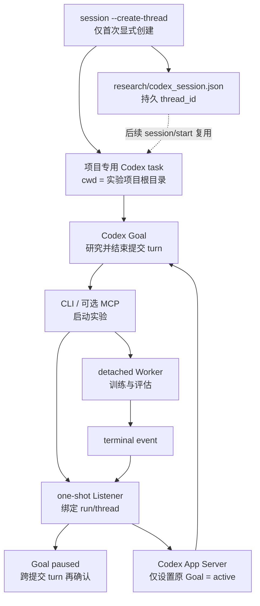
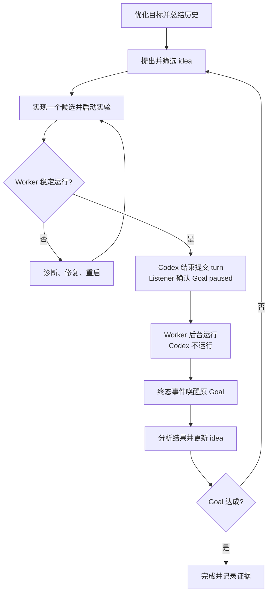

# Auto Research Agent

当前 `main` 是 v0.3 简化方案：Codex Goal 是唯一研究 Agent；本项目只提供 detached 实验运行和一个事件驱动的 Goal 唤醒桥。

Codex 自己负责优化目标、调查资料、提出 idea、修改代码、判断实验是否稳定、结束提交 turn、分析结果以及决定继续或完成。Listener 只在实验交接边界确认 Goal paused/active；本项目不再运行固定 cycle，也不替 Codex 决定研究步骤。

## 版本

| 版本 | Git 位置 | 方案 |
|---|---|---|
| v0.1.0 | tag `v0.1.0` | 原 `main` 的完整 Goal Harness |
| v0.2.0 | tag `v0.2.0`、branch `goal-autonomous-research` | Codex 自主研究 + 完整生命周期 Harness |
| v0.3.0 | `main` | Codex 自主暂停 + one-shot Goal Wake Listener |

历史版本可以直接检出：

```bash
git switch --detach v0.1.0
git switch --detach v0.2.0
```

## 当前架构



Listener 不调用 `thread/resume` 或 `turn/start`，不会和桌面端争抢 thread writer，也不创建研究 cycle。它只把持久 Goal 从 `paused` 改回 `active`，后续 turn 完全由原生 Goal 调度器拥有。安装 `watchfiles` 时监听操作系统文件事件；否则只轮询本地终态文件，不调用模型或 MCP。

## 研究闭环



详细组件边界、时序图、状态图以及与历史方案的对比见[当前方案设计](docs/CODEX_AUTO_RESEARCH_AGENT_DESIGN.md)。

## 方案对比摘要

| 方案 | 主研究 Agent | 实验期间模型轮询 | 自动恢复 | 外部流程复杂度 |
|---|---|---|---|---|
| Python/Agents SDK Director | 外部 Director | 取决于实现 | 有 | 高 |
| v0.1/v0.2 完整 GoalHarness | Codex 或 Harness 分担 | 无 | 有 | 高 |
| `start` 后人工查询 | Codex | 无 | 无 | 低但不能闭环 |
| v0.3 one-shot Listener | Codex Goal | 无 | 有 | 低 |

## 安装

```bash
uv venv
uv sync --extra watcher
```

如果使用可选的 Experiment MCP：

```bash
uv sync --extra mcp --extra watcher
```

认证由本机 Codex CLI/App Server 管理：

```bash
codex login status
```

项目不会读取或保存 API key。

## 初始化

```bash
uv run auto-research init /path/to/experiment-project
```

这会创建：

- `goal.json`：供 Codex 审查和优化的初始目标。
- `research/config.toml`：实验和 listener 的唯一配置文件。

配置模板见 [config.toml.example](config.toml.example)。

## 推荐：为实验项目创建一个专用会话

首次启动一个项目时显式传 `--create-thread`：

```bash
uv run auto-research session \
  --project /path/to/experiment-project \
  --create-thread \
  --title "Breast Cancer Auto Research"
```

该命令通过 Codex App Server 创建一个 `cwd` 精确等于实验项目根目录的持久 task，命名后把 Goal 设为 `paused`，并立即把 `thread_id` 写入本机状态 `research/codex_session.json`（已加入 `.gitignore`）。默认 objective 来自 `goal.json.statement`，也可以显式传 `--objective`。

`--create-thread` 是幂等的：即使重复执行，也会验证并复用状态文件中的 task，不会再次调用 `thread/start`。后续只需：

```bash
uv run auto-research session --project /path/to/experiment-project
```

如果已经在 Codex 中手动建好了绑定该目录的 task，可以采用它而不创建新 task：

```bash
uv run auto-research session \
  --project /path/to/experiment-project \
  --thread-id <existing-codex-thread-id>
```

只有显式提供新的 `--objective --replace-goal` 才会替换已有 Goal；普通复用不会重置 Goal 用量或目标。会话准备命令也不会调用 `turn/start`，因此不会在后台留下一个无人管理的 active turn。新 task 默认 paused，首次创建后在 Codex 中打开输出的 `thread_id`，发送研究启动指令并激活 Goal 即可。

## 推荐：Codex 直接启动实验

在 Codex Goal 中执行：

```bash
uv run auto-research start \
  --project /path/to/experiment-project \
  --idea-id idea-001 \
  --worktree /path/to/experiment-project \
  --timeout-s 14400 \
  --command 'python train.py --config candidate.yaml'
```

命令会立即返回类似结果：

```json
{
  "run_id": "run-idea-001-ab12cd34",
  "status": "RUNNING",
  "wake_listener": {
    "status": "ARMED",
    "thread_id": "019f..."
  }
}
```

`auto-research start` 会同时完成：

1. 落盘 `run.json`。
2. 启动独立 session 的 detached Worker。
3. 在 Codex 内优先从 `CODEX_THREAD_ID` 精确绑定当前 Goal task；终端调用则复用 `research/codex_session.json` 中的专用 task。
4. 启动 detached one-shot listener。

如果当前 `CODEX_THREAD_ID` 与项目专用 task 不一致，提交会直接失败，避免实验完成后唤醒错误会话。请切换到专用 task 后重试。

Codex 随后检查 `heartbeat.json` 或日志，确认实验稳定运行，然后结束当前 turn。Listener 会先写入 paused，并在该 turn 持久结束后再次确认 paused，避免 turn finalization 把状态覆盖回 active。不要让 Codex 循环查询 `RUNNING`。

推荐提示词见 [Codex Goal 提示词](docs/CODEX_GOAL_PROMPT.md)。

## 查看状态

```bash
uv run auto-research status run-idea-001-ab12cd34 \
  --project /path/to/experiment-project
```

每个 run 的持久状态位于：

```text
research/runs/<run_id>/
├── run.json
├── heartbeat.json
├── worker.log
├── metrics.json
├── events/<terminal>.json
├── wake-launch.json
├── wake.json
└── wake-listener.log
```

`wake.json` 状态转换如下：

```text
BINDING -> PAUSE_HANDOFF -> WAITING -> TERMINAL -> ACTIVATING -> ACTIVATED
              └──────────────────────────────────────────> SKIPPED
```

## 异常恢复

Listener 在 App Server 暂时不可用时会在本地指数退避重试，不消耗模型 token。进程意外退出或机器重启后执行：

```bash
uv run auto-research recover-wakes --project /path/to/experiment-project
```

也可以给单个 run 重新绑定：

```bash
uv run auto-research arm-wake run-... \
  --project /path/to/experiment-project \
  --thread-id <codex-thread-id>
```

如果 `CODEX_THREAD_ID` 不可用，Listener 会通过 App Server 的 `thread/list(cwd=...)` 查找最近的 active/paused Goal。候选不明确时会持续等待显式绑定，不会唤醒猜测出来的历史任务。

## 可选：Experiment MCP

CLI 已经足以完成闭环。需要结构化工具调用时再注册 MCP：

```bash
uv run auto-research register-mcp --project /path/to/experiment-project
```

MCP 只提供：

- `start_experiment`
- `get_experiment_result`
- `cancel_experiment`

`start_experiment` 与 CLI `start` 使用相同 Runner，并自动启动同一个 one-shot listener。MCP 工具本身不判断 Goal 或算法；paused/active 交接由 Listener 完成。

## 安全和并发边界

- 默认一个项目只允许一个未终态实验。
- `idempotency_key` 防止工具重试重复提交。
- Worker 使用独立 session；终端、MCP 或 Codex turn 结束不会杀死训练。
- 终态写入带锁，成功、失败、超时、取消和 LOST 只会有一个最终结果。
- Listener 按 `run_id -> thread_id` 持久绑定并加单实例锁，重复文件事件不会重复激活 Goal。
- 专用 task 只在首次显式 `--create-thread` 时创建；状态文件损坏或项目 `cwd` 不匹配时失败关闭，不自动猜测或补建。
- Goal 已经由其他执行者运行、complete、blocked 或受限时，Listener 不会盲目激活。
- Listener 不设置 Codex 模型、reasoning effort、sandbox 或 approval；这些属性继承原 Goal task。实验命令当前默认 `shell=true`，只应在隔离实验环境使用。

## 文档

- [当前方案设计](docs/CODEX_AUTO_RESEARCH_AGENT_DESIGN.md)
- [Codex Goal 提示词](docs/CODEX_GOAL_PROMPT.md)
- [版本与历史方案](docs/HISTORY_DESIGN_ALTERNATIVES.md)
- [历史问题与修复](docs/HISTORY_BUG_FIXES.md)
- [Codex App Server 官方文档](https://learn.chatgpt.com/docs/app-server)

## 验证

```bash
uv run python -m unittest discover -s tests -v
```
