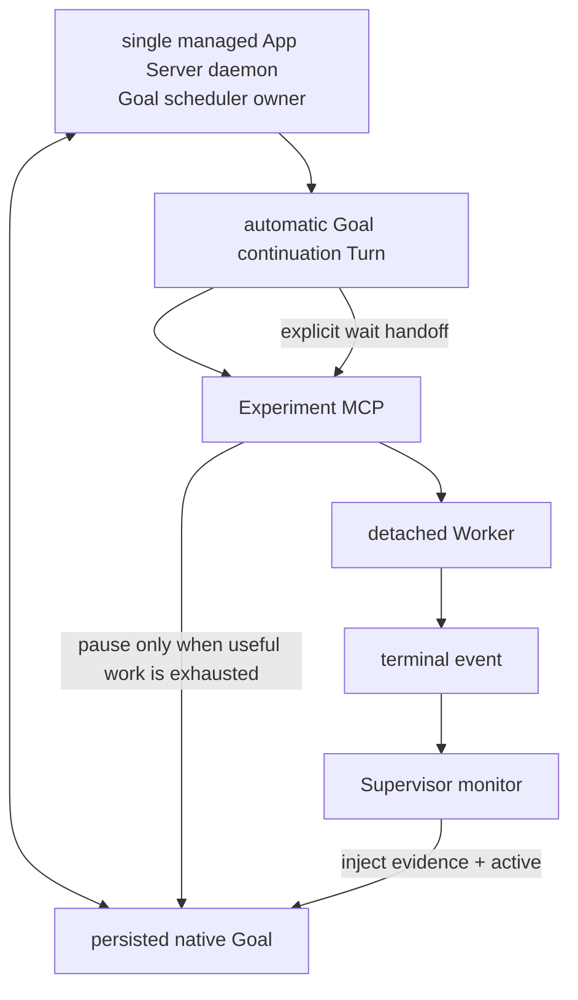
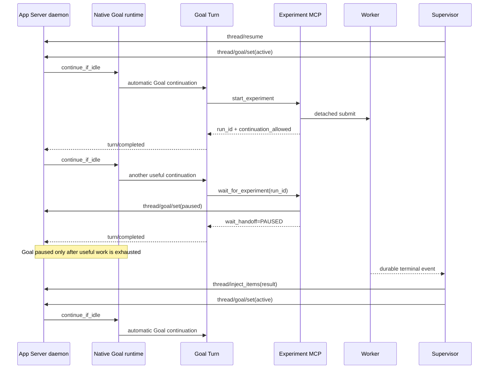
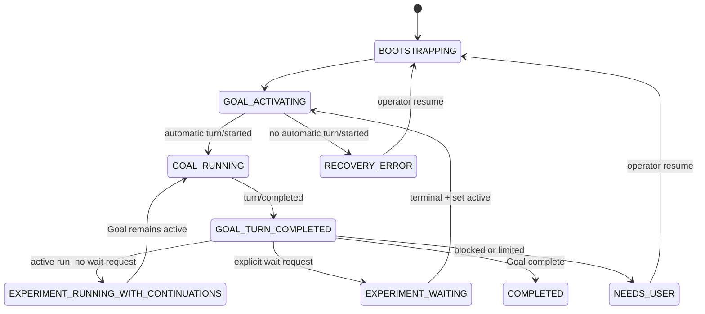

# Native App Server Goal Runtime + Experiment Supervisor

## 1. 目标与结论

本方案让 Codex 原生 Goal 持续负责研究，Supervisor 只解决长实验的等待与恢复：

1. App Server Goal runtime 自动创建 Goal continuation。
2. Goal Turn 启动实验后保持 active，允许继续产生有价值的 continuation。
3. 只有 Agent 明确声明“只剩等待”时才切换为 `paused`；Supervisor 等本地终态。
4. 终态后 Supervisor 设置 `active`，Goal runtime 自动创建下一 Turn。
5. 完全不依赖 Desktop scheduler 或 Desktop host 私有工具。

当前 Codex 的 Goal runtime 在外部 Goal 更新为 `active` 时执行
`continue_if_idle()`，并通过 `try_start_turn_if_idle()` 创建 continuation；恢复
Thread 时也会恢复 active Goal 的 accounting 并触发 idle lifecycle。

## 2. 所有权模型



| 所有权 | Owner |
|---|---|
| Goal research decisions | Codex Goal Turn |
| Goal continuation scheduling | managed App Server Goal runtime |
| experiment execution | detached Worker |
| experiment wait/wake | Supervisor monitor |
| project monitor singleton | filesystem lock |

Supervisor 不是 Thread writer，也不构造 continuation prompt，更不调用
`turn/start`。

## 3. 为什么必须使用 managed daemon

Goal runtime 的 idle check、thread map、semaphore 和 active turn accounting 是
App Server 进程内状态。多个独立 App Server 进程共享同一个 `CODEX_HOME` 时，可能
各自认为同一个 active Goal idle，并创建重复 continuation。

因此：

- daemon：`codex app-server daemon start`
- client：连接 lifecycle `socketPath` 指向的 Unix WebSocket
- 同一 Goal 的 session bootstrap、Supervisor 和实验暂停控制全部连接该 daemon。
- 禁止为该 Thread 启动另一个独立 `codex app-server --stdio`。

Supervisor 默认使用 `research/supervisor_session.json` 创建或复用独立 Thread。
`--adopt-session` 才允许复用 `research/codex_session.json`；是否接管现有会话必须由
操作者显式选择，不能根据项目已有绑定静默决定。

多个 WebSocket connection 是同一进程内的多个订阅者，不等于多个 Goal
scheduler。`codex app-server proxy` 透传的是 WebSocket 字节流，不接收 App Server
JSONL；Supervisor 因此直接执行 WebSocket 握手，并关闭 compression 扩展。

### 3.1 Codex daemon 是什么

这里的 Codex daemon 是**本机后台常驻的 Codex App Server 进程**。它不是模型、
Goal、Turn、Supervisor 或实验 Worker。它负责持有 App Server 的进程内运行时，并
通过 Unix WebSocket 让多个客户端访问同一份 Thread/Goal 调度状态：

```text
Codex App Server daemon
├── Thread/Goal 运行时状态
├── Goal scheduler 和 idle lifecycle
├── Goal continuation Turn 创建
├── thread/goal/set(active | paused)
└── Unix WebSocket
    ├── Supervisor
    ├── Goal Turn 中的 Experiment MCP
    └── session bootstrap 客户端
```

组件边界如下：

| 组件 | 职责 |
|---|---|
| daemon | App Server 运行时和 Goal 调度中心 |
| Goal | 持久化的长期研究目标 |
| Turn | 模型实际执行的一轮工作 |
| Supervisor | 监控实验终态，并请求 daemon 暂停或激活 Goal |
| Experiment Worker | 独立运行训练或评估，不属于 daemon |
| Desktop | 另一种 Codex 宿主界面，不等于本方案的 managed daemon |

当前 auto-research 使用 `codex app-server daemon start` 获取 lifecycle JSON，并连接
其中的 `socketPath`；只需要定位已有 daemon 的受限客户端使用
`codex app-server daemon version`，避免在沙箱内触碰 daemon PID lock。官方公开文档
把这类进程称为 local app-server daemon，并公开了
`codex remote-control start/stop` 生命周期入口；文档同时说明 remote-control 客户端
不替代面向自定义本地协议客户端的 `codex app-server --listen`：

- [Codex developer commands: codex remote-control](https://learn.chatgpt.com/docs/developer-commands#codex-remote-control)
- [Import in Codex CLI](https://learn.chatgpt.com/docs/import#import-in-codex-cli)

### 3.2 在 Desktop 中打开 Supervisor 专用会话

Supervisor 创建的 Thread 使用普通 Codex 持久化记录，因此出现在 Desktop 侧边栏是
正常现象。**仅在侧边栏看到它不会影响 Supervisor。**

运行中的“点击打开”不能视为受保证的只读操作。Desktop 可能对该 Thread 执行
`thread/resume`，从而让 Desktop 的独立 App Server host 加载它；这和多个客户端连接
同一个 managed daemon 不同。后者只是同一 scheduler 的多个订阅者，前者可能形成
第二个 runtime/writer，并带来以下风险：

- managed daemon 与 Desktop 对同一 Thread 争抢 writer；
- Desktop 中看到的 effective Goal 状态与 managed daemon 的实时状态不同步；
- 打开时恢复 active Goal，或用户发送消息后创建非 Supervisor 预期的 Turn；
- 用户手动暂停、恢复、修改 Goal 或中断 Turn，破坏 Supervisor 状态机假设。

因此在 Supervisor campaign 未完成时采用以下操作约束：

1. 可以在侧边栏看到专用会话，但不要点击进入。
2. 不要在该会话中发消息，也不要操作 Goal、停止按钮或重试按钮。
3. 通过 `research/supervisor/state.json`、run 终态文件和 Supervisor CLI 查看进度。
4. campaign 完成、Supervisor 进入 `COMPLETED` 并退出后，再从 Desktop 打开会话查看。

当前实现没有阻止 Desktop 打开该 Thread 的宿主级互斥机制，因此这是一条运行安全
约束，而不是 UI 已强制执行的限制。如果误点但没有发送消息或操作 Goal，不应直接
判定 campaign 已损坏；应以 managed daemon 的 Goal 状态、Supervisor 状态和是否出现
非预期 Turn 为准进行一次对账。

## 4. 正常时序



显式等待交接仍必须在 `wait_for_experiment` 返回前完成；区别是启动实验本身不再触发
交接。Agent 可以经历任意多个 continuation，直到主动声明只剩等待。

## 5. 状态机



`GOAL_ACTIVATING` 的成功条件不是读回 `active`，而是同一 daemon 发出新的
`turn/started`。Supervisor随后只观察该 Turn 的 `turn/completed`。

## 6. 实验启动与显式等待协议

`start_experiment` 完成以下边界：

1. 校验当前 Thread 与项目专用 Thread 一致。
2. 持久化 run、active marker 和 Goal contract snapshot。
3. 启动 detached Worker。
4. marker 写入 `wait_requested=false`。
5. 返回 `goal_pause.status=NOT_REQUESTED` 和 `continuation_allowed=true`。

之后 Agent 继续所有可并行工作。只有只剩等待时调用 `wait_for_experiment(run_id)`；
该工具校验 run/thread 精确绑定，将 marker 更新为 `wait_requested=true`，同步设置 Goal
`paused`，写入 `experiment_handoff.json`，并返回 `wait_handoff=PAUSED`。

## 7. 实验恢复协议

Supervisor观察到 terminal event 后：

1. 校验 run 的 `codex_thread_id`。
2. 清除匹配的 `active_experiment.json`。
3. 用 `thread/inject_items` 写入不可信的终态 JSON、artifact path 和日志尾部。
4. 若 Goal 已因显式等待而 paused，设置 Supervisor 状态 `GOAL_ACTIVATING`，调用
   `thread/goal/set(active)` 并等待自动 `turn/started`。
5. 若 Goal 本来仍 active，则保留 continuation lifecycle，不重复切换状态。

无论哪条路径，Supervisor 都不得调用 `turn/start` 补救。

显式等待恢复后如果 120 秒内没有自动 Turn，进入 `RECOVERY_ERROR`。这样可以暴露
feature、daemon ownership 或 runtime 状态问题，而不会偷偷降级成普通 Turn。

## 8. 重启恢复

Supervisor启动顺序同时区分 active run 和显式等待标记：

- active run 且 `wait_requested=false`：保持/恢复 Goal active，继续 continuation；
  Supervisor 只在每个 Turn 终点读取 durable run 状态。
- active run 且 `wait_requested=true`：先设置 `paused` 再 `thread/resume`，随后恢复
  本地终态等待。
- 不存在 active run：直接 `thread/resume`。active Goal 会由 daemon 自动续跑；
  paused 初始 Goal由 Supervisor 显式设为 active。
- 已有 in-progress Turn：从 resume/read 返回的 Turn 列表取得 ID并继续等待终态。
- Goal complete：Supervisor结束。
- blocked/usageLimited/budgetLimited：进入 `NEEDS_USER`。

## 9. 持久文件

| 文件 | 用途 |
|---|---|
| `research/supervisor_session.json` | 默认 Supervisor 专用 Thread 绑定 |
| `research/codex_session.json` | 可选 `--adopt-session` 的既有 Thread 绑定 |
| `research/active_experiment.json` | 当前非终态 run 提示 |
| `research/supervisor/state.json` | monitor 状态、Turn ID、run、终态结果 |
| `research/supervisor/active_experiment.json` | Supervisor 会话当前非终态 run |
| `research/supervisor/experiment_handoff.json` | `wait_for_experiment` 已暂停 Goal 的证据 |
| `research/runs/<run_id>/...` | Worker 和终态事实 |

旧 Listener 的 `research/active_experiment.json` 与 Supervisor marker 分离。这样独立
Supervisor 会话可以在另一组 GPU 上运行一个实验，而不会接管已有 Desktop run；但
每个 Supervisor 仍只有一个 active run，评估 campaign 仍需串行。

## 10. 验证门槛

单元测试必须证明：

- Supervisor代码路径从不调用 `turn/start`；
- paused Goal 激活后观察到 native `turn/started`；
- run 终态后注入结果并重新 active；
- 第二次 Goal continuation 能继续并完成；
- Supervisor-owned run 不启动旧 Listener；
- 启动 run 后至少允许两次 native continuation；
- 显式 wait handoff 与 run/thread 精确绑定，且只有 handoff 后才暂停。

真实 daemon smoke test 还需验证：

1. 不发送 `turn/start`，仅 `set(active)` 即出现 `turn/started`。
2. active Turn 内 set(paused) 后，Turn结束不再 continuation。
3. set(active) 后重新出现 Goal continuation。
4. daemon重启后 active/paused run 恢复符合预期。

参考：

- [App Server README](https://github.com/openai/codex/blob/main/codex-rs/app-server/README.md)
- [Goal runtime source](https://github.com/openai/codex/blob/main/codex-rs/ext/goal/src/runtime.rs)
- [多 App Server Goal 并发问题](https://github.com/openai/codex/issues/32793)
