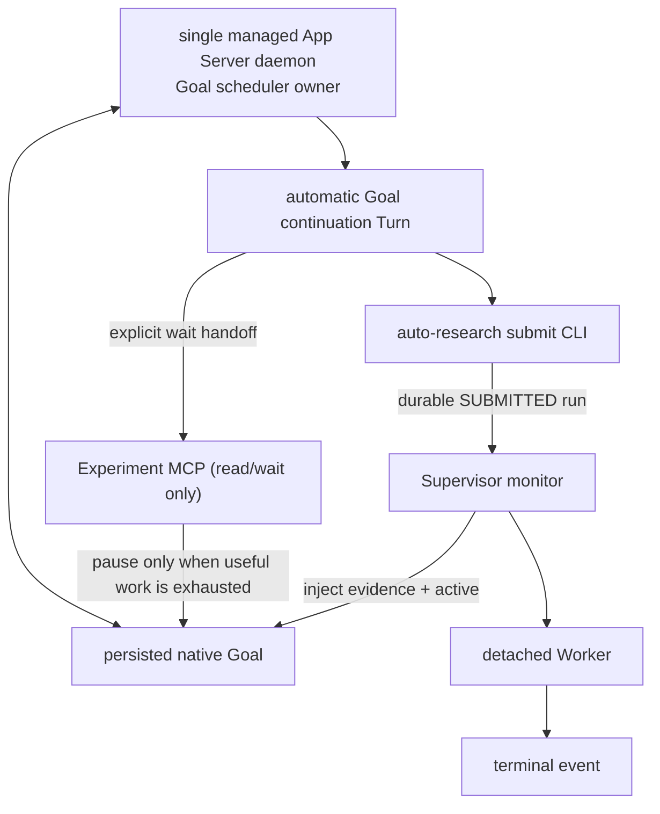
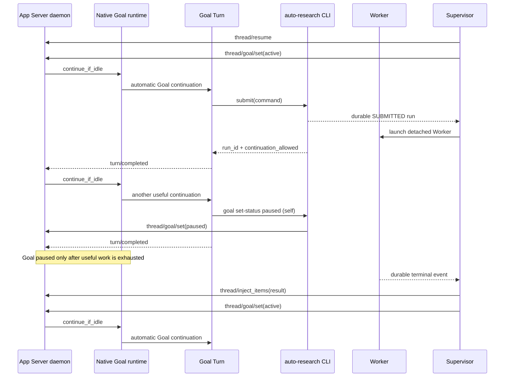
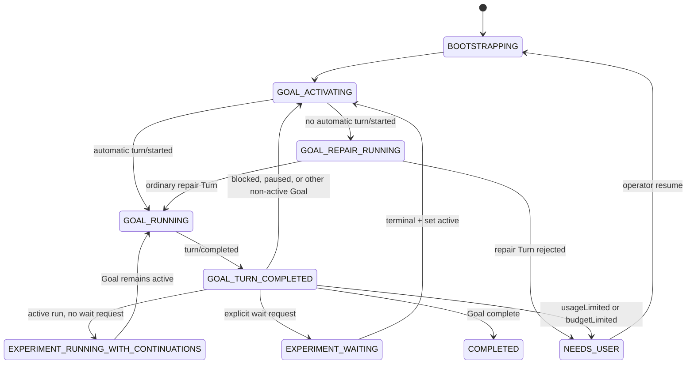

# Native App Server Goal Runtime + Experiment Supervisor

## 1. 目标与结论

本方案让 Codex 原生 Goal 持续负责研究，Supervisor 只解决长实验的等待与恢复：

1. App Server Goal runtime 自动创建 Goal continuation。
2. Goal Turn 启动实验后保持 active，允许继续产生有价值的 continuation。
3. 只有 Agent 明确声明“只剩等待”时才切换为 `paused`；Supervisor 等本地终态。
4. 终态后 Supervisor 设置 `active`，Goal runtime 自动创建下一 Turn。
5. 完全不依赖 Desktop scheduler 或 Desktop host 私有工具。

当前 Codex 的 Goal runtime 在外部 Goal 更新为 `active` 时执行
`continue_if_idle()`，并通过 `try_start_turn_if_idle()` 创建 continuation；恢复
Thread 时也会恢复 active Goal 的 accounting 并触发 idle lifecycle。该实现细节来自
当前 Codex 源码，不应被误写为稳定的公开 API 契约；Supervisor 因而以实际
`turn/started` 事件而不是仅凭 `active` 回包判断成功。

### 1.1 参考、实现与证据边界

| 结论 | 权威或代码参考 | 本仓库实现/验证 |
|---|---|---|
| Goal 适合承载长期工作 | [OpenAI Developers: Follow a goal](https://developers.openai.com/codex/use-cases?category=automation&category=evaluation&category=sciences&task_type=analysis&task_type=code&task_type=design&team=design-engineering&team=engineering&team=operations&team=research) | 本文的 Goal/Turn/Worker 职责划分 |
| App Server 线程、Turn 与通知协议 | [Codex App Server README](https://github.com/openai/codex/blob/main/codex-rs/app-server/README.md) | [`app_server.py`](../src/auto_research/app_server.py) 的 WebSocket client 与精确 Turn 等待 |
| 原生 Goal continuation 的当前实现 | [Goal runtime source](https://github.com/openai/codex/blob/main/codex-rs/ext/goal/src/runtime.rs) | `thread/goal/set(active)` 后等待 `turn/started`；不把源码行为当公开稳定承诺 |
| 多 runtime/同一 Thread 的风险 | [Codex issue #32793](https://github.com/openai/codex/issues/32793) | managed daemon 单实例、Supervisor lock、独立 supervisor Thread |
| recoverable Goal 状态的本地策略 | [`supervisor.py`](../src/auto_research/supervisor.py) | [`test_supervisor.py`](../tests/test_supervisor.py)：blocked 唤醒、native timeout repair、repair 拒绝才 NEEDS_USER |

链接的职责不同：OpenAI Developers 页面说明产品用途；App Server README 和 Goal runtime
源码说明当前协议/实现；本项目测试才是本方案回归保证。上游实现升级时，必须重新跑
Supervisor smoke test，不能只因为链接仍可访问就假设生命周期行为未改变。

## 2. 所有权模型



| 所有权 | Owner |
|---|---|
| Goal research decisions | Codex Goal Turn |
| Goal continuation scheduling | managed App Server Goal runtime |
| experiment execution | detached Worker |
| experiment wait/wake | Supervisor monitor |
| project monitor singleton | filesystem lock |

Supervisor 不构造正常的 continuation prompt，也不参与研究决策。它只在 native Goal
无法激活或已经 active 却未产生 `turn/started` 时构造一个带 run id 与故障原因的普通
repair Turn；这是可审计的恢复机制，不是第二个 scheduler。

## 3. 为什么必须使用 managed daemon

Goal runtime 的 idle check、thread map、semaphore 和 active turn accounting 是
App Server 进程内状态。多个独立 App Server 进程共享同一个 `CODEX_HOME` 时，可能
各自认为同一个 active Goal idle，并创建重复 continuation。

因此：

- daemon：`codex app-server daemon start`
- client：连接 lifecycle `socketPath` 指向的 Unix WebSocket
- 同一 Goal 的 session bootstrap、Supervisor 和实验暂停控制全部连接该 daemon。
- 禁止为该 Thread 启动另一个独立 `codex app-server --stdio`。

Supervisor 默认使用 `session-mode=auto`。同一 state root 只有
`codex_session.json` 时复用该 Thread，只有 `supervisor_session.json` 时复用独立
Supervisor Thread，两者都不存在时创建后者。若两个绑定同时存在且没有 controller
持久模式，启动必须失败，不能静默选择或创建新 Thread。只有修复历史歧义目录时才使用
`--session-mode adopted|dedicated`；模式一旦写入 controller state，后续
`start/resume/restart` 自动沿用。

### 3.1 Supervisor 会话选择机制

Thread 选择本质上只有两种动作：

1. **新建 Thread**：state root 没有可复用绑定时，通过 App Server
   `thread/start` 创建并持久化；
2. **复用已有 Thread**：读取绑定文件中的精确 `thread_id`。复用当前桌面会话、
   历史会话或刚由 `session --create-thread` 创建的会话，底层都属于这一类。

`dedicated` 和 `adopted` 不是不同种类的 App Server Thread，只表示绑定来源：

| 有效模式 | 绑定文件 | Thread 由谁选择 |
|---|---|---|
| `dedicated` | `<state-root>/supervisor_session.json` | Supervisor 在没有绑定时创建，之后严格复用 |
| `adopted` | `<state-root>/codex_session.json` | 操作者先通过 `session --create-thread` 或 `session --thread-id` 选择，Supervisor 接管 |
| `auto` | 不新增绑定文件 | 解析策略，最终必须收敛为 `dedicated` 或 `adopted` |

Supervisor 不会按标题、最近活跃时间、Goal 文本、当前桌面焦点或其他 state root
搜索 Thread。实际选择范围严格限定在本次 `--state-root` 内。

`auto` 的解析顺序为：

1. `<state-root>/supervisor/state.json` 已记录有效 `session_mode`：沿用该模式，并
   校验对应绑定仍存在；
2. 只有 `codex_session.json`：选择 `adopted`；
3. 只有 `supervisor_session.json`：选择 `dedicated`；
4. 两者都不存在：选择 `dedicated`，首次启动时创建新 Thread；
5. 两者同时存在且 controller 没有持久模式：拒绝启动，禁止猜测或创建第三个
   Thread。

同一 state root 的并发 bootstrap 通过文件锁串行化；绑定文件损坏、项目根不匹配、
初始化未完成或缺少有效 `thread_id` 时也必须失败关闭，不能静默生成替代 Thread。
因此相同 state root 后续总是复用同一 Thread，而新的 state root 才代表新的独立研究
命名空间。

新建一个由操作者预先定义标题和 Goal 的研究会话：

```bash
uv run auto-research session \
  --project /path/to/project \
  --state-root research/supervisors/run-a \
  --create-thread \
  --title "Auto Research · run-a" \
  --objective "..."

uv run auto-research supervisor start \
  --project /path/to/project \
  --state-root research/supervisors/run-a
```

复用任意已知 Thread（包括当前桌面 Thread）：

```bash
uv run auto-research session \
  --project /path/to/project \
  --state-root research/supervisors/run-a \
  --thread-id <existing-thread-id> \
  --objective "..."
```

不预先选择 Thread、直接让 Supervisor 创建 dedicated 会话：

```bash
uv run auto-research supervisor start \
  --project /path/to/project \
  --state-root research/supervisors/run-a
```

“两个绑定都有但没有持久模式”通常来自旧版混用两套启动流程、同一 state root 曾在
两种模式间切换、只恢复了部分文件、手动复制状态，或删除 `supervisor/` 后保留两个
session 文件。此时先核对两个文件中的 `thread_id`，再明确选择一次：

```bash
uv run auto-research supervisor start ... --session-mode adopted
# 或
uv run auto-research supervisor start ... --session-mode dedicated
```

成功启动后模式写入 `supervisor/state.json`，以后恢复默认 `auto` 即可。不要通过删除
不确定归属的绑定文件来消除歧义；需要清理时应先保留审计副本并确认目标 Thread。

当该 Thread 的 Goal 已完成时，普通 `supervisor start` 保持控制器终态，绝不隐式重建
或重放旧 Goal。若希望保留同一 Thread 的上下文但开启下一轮研究，使用
`supervisor restart --objective "..."`：它复用 session binding、显式替换 Goal，并创建
新的 Supervisor 生命周期。

多个 WebSocket connection 是同一进程内的多个订阅者，不等于多个 Goal
scheduler。`codex app-server proxy` 透传的是 WebSocket 字节流，不接收 App Server
JSONL；Supervisor 因此直接执行 WebSocket 握手，并关闭 compression 扩展。

### 3.2 Codex daemon 是什么

这里的 Codex daemon 是**本机后台常驻的 Codex App Server 进程**。它不是模型、
Goal、Turn、Supervisor 或实验 Worker。它负责持有 App Server 的进程内运行时，并
通过 Unix WebSocket 让多个客户端访问同一份 Thread/Goal 调度状态：

```text
Codex App Server daemon
├── Thread/Goal 运行时状态
├── Goal scheduler 和 idle lifecycle
├── Goal continuation Turn 创建
├── thread/goal/set(active | paused)
└── Unix WebSocket
    ├── Supervisor
    ├── Goal Turn 中的 Experiment MCP（仅查询/等待）
    └── session bootstrap 客户端
```

组件边界如下：

| 组件 | 职责 |
|---|---|
| daemon | App Server 运行时和 Goal 调度中心 |
| Goal | 持久化的长期研究目标 |
| Turn | 模型实际执行的一轮工作 |
| Supervisor | 监控实验终态，并请求 daemon 暂停或激活 Goal |
| Experiment Worker | 独立运行训练或评估，不属于 daemon |
| Desktop | 另一种 Codex 宿主界面，不等于本方案的 managed daemon |

当前 auto-research 使用 `codex app-server daemon start` 获取 lifecycle JSON，并连接
其中的 `socketPath`；只需要定位已有 daemon 的受限客户端使用
`codex app-server daemon version`，避免在沙箱内触碰 daemon PID lock。官方公开文档
把这类进程称为 local app-server daemon，并公开了
`codex remote-control start/stop` 生命周期入口；文档同时说明 remote-control 客户端
不替代面向自定义本地协议客户端的 `codex app-server --listen`：

- [Codex developer commands: codex remote-control](https://learn.chatgpt.com/docs/developer-commands#codex-remote-control)
- [Import in Codex CLI](https://learn.chatgpt.com/docs/import#import-in-codex-cli)

### 3.2 在 Desktop 中打开 Supervisor 专用会话

Supervisor 创建的 Thread 使用普通 Codex 持久化记录，因此出现在 Desktop 侧边栏是
正常现象。**仅在侧边栏看到它不会影响 Supervisor。**

运行中的“点击打开”不能视为受保证的只读操作。Desktop 可能对该 Thread 执行
`thread/resume`，从而让 Desktop 的独立 App Server host 加载它；这和多个客户端连接
同一个 managed daemon 不同。后者只是同一 scheduler 的多个订阅者，前者可能形成
第二个 runtime/writer，并带来以下风险：

- managed daemon 与 Desktop 对同一 Thread 争抢 writer；
- Desktop 中看到的 effective Goal 状态与 managed daemon 的实时状态不同步；
- 打开时恢复 active Goal，或用户发送消息后创建非 Supervisor 预期的 Turn；
- 用户手动暂停、恢复、修改 Goal 或中断 Turn，破坏 Supervisor 状态机假设。

因此在 Supervisor campaign 未完成时采用以下操作约束：

1. 可以在侧边栏看到专用会话，但不要点击进入。
2. 不要在该会话中发消息，也不要操作 Goal、停止按钮或重试按钮。
3. 通过 `research/supervisor/state.json`、run 终态文件和 Supervisor CLI 查看进度。
4. campaign 完成、Supervisor 进入 `COMPLETED` 并退出后，再从 Desktop 打开会话查看。

当前实现没有阻止 Desktop 打开该 Thread 的宿主级互斥机制，因此这是一条运行安全
约束，而不是 UI 已强制执行的限制。如果误点但没有发送消息或操作 Goal，不应直接
判定 campaign 已损坏；应以 managed daemon 的 Goal 状态、Supervisor 状态和是否出现
非预期 Turn 为准进行一次对账。

## 4. 正常时序



显式等待交接由 Goal 自己执行 `auto-research goal set-status paused` 完成；该 CLI 仅允许修改项目绑定的自身 Thread，直接调用 App Server `thread/goal/set`，不经过 MCP 审批。启动实验本身不触发交接。Agent 可以经历任意多个 continuation，直到主动声明只剩等待。

## 5. 状态机



`GOAL_ACTIVATING` 的成功条件不是只读回 `active`，而是同一 daemon 发出新的
`turn/started`。如果 120 秒内没有该执行证据，Supervisor 创建一个带明确原因和
持久状态引用的普通 repair Turn；仅当这个 Turn 也无法创建时才进入 `NEEDS_USER`。

## 6. 实验启动与显式等待协议

`[codex].model`、approval policy 与 sandbox 只是创建或恢复 Goal task 时的 App Server
会话参数，不是实验提交或 Worker 启动的前置校验。Supervisor 不对 Codex 已提交的命令做
模型可用性预检或 Goal 状态拦截。

同一配置还必须传递 `approval_policy="never"` 与 `sandbox="workspace-write"`。
默认提交通道是 `auto-research submit` CLI，不依赖 MCP 写入确认。写入型
`submit_experiment` MCP 目前不向 Goal 暴露；它仅作为未来严格白名单自动审批方案的
TODO，不能以 `danger-full-access` 绕过确认。

`auto-research submit` 完成以下边界：

1. 校验当前 Thread 与项目专用 Thread 一致。
2. 持久化 run、active marker 和 Goal contract snapshot。
3. 将 Codex 生成的命令以 `SUBMITTED` 状态持久化；不创建 Worker 进程。
4. marker 写入 `wait_requested=false`。
5. 返回 `goal_pause.status=NOT_REQUESTED` 和 `continuation_allowed=true`。

Supervisor 是唯一 Worker 启动者：它观察到 `SUBMITTED` 后调用 Runner launch，随后
持有并监控 detached Worker。Goal Turn、MCP server 和普通 Codex shell 都不得绕过
Supervisor 直接启动长实验。

提交后 Agent 继续所有可并行工作。只有只剩等待时调用 `auto-research goal set-status paused`；
该 CLI 校验调用者只能修改项目精确绑定的自身 Thread，并同步设置 Goal `paused`。Experiment MCP
不参与该控制面，避免平台 MCP 审批取消影响 Goal 生命周期。

## 7. 实验恢复协议

Supervisor观察到 terminal event 后（成功、失败、超时、取消与 LOST 完全等价）：

1. 校验 run 的 `codex_thread_id`。
2. 清除匹配的 `active_experiment.json`。
3. 清空当前阶段的 `run_id`；最近一次终态只保留 `last_terminal_run_id`，完整结果仍从 run 目录读取。
4. 用 `thread/inject_items` 写入不可信的终态 JSON、artifact path 和日志尾部。
5. 无条件尝试 `thread/goal/set(active)`，把终态交给 Goal runtime 消费。
6. 若 wake-up 被拒绝，保留终态与 wake-up error 到状态文件；不得保留 active marker
   或停止对已启动 Worker 的监控。对于 `blocked`、`paused` 和未知非 active 状态，立即
   尝试 `active`；若仍失败则创建普通 repair Turn。`usageLimited`、`budgetLimited`、认证
   或 transport 使 repair Turn 也无法创建时，才进入 `NEEDS_USER`。

### 普通 Turn fallback

实验终态后，Supervisor 先调用 `thread/goal/set(active)` 并验证返回的 Goal 状态确实为
`active`。如果 App Server 保留 `blocked` 等非 active 状态或请求报错，当前实现会立即
创建一个**窄范围、可审计的普通 repair Turn**，把 run id 和激活失败原因交给 Codex。

`thread/goal/set(active)` 已成功、但 120 秒内仍未收到原生 `turn/started` 时，当前实现：

1. 再次读取 Thread，确认不存在 active/in-progress Turn。
2. 调用 `turn/start`；该请求同时验证 App Server transport、模型认证和账户额度。
3. 将刚注入的 run id、终态和 artifact 路径作为普通用户输入，要求
   Codex 分析错误并继续研究。
4. 写入 `recovery_turn_id`、触发原因和结果，防止重复创建 fallback Turn。

该 fallback 不得用于并发抢占活跃 Goal Turn，也不能绕过 `usageLimited`、
`budgetLimited`、refresh-token 失败或其他模型侧拒绝；这些情况下普通 Turn 同样无法
执行，应保留终态和失败诊断等待认证/额度恢复。

### 排障：已登录但 App Server refresh token 失败

桌面插件、Codex CLI 和已经运行的 App Server daemon 是不同的本地认证生命周期。
`codex login status` 显示已使用 ChatGPT 登录，只证明当前 CLI 的持久凭证可读；它**不**
保证一个早于重新登录启动的 daemon 已经丢弃内存中的旧 refresh token。典型终态是
Goal activation 后的普通/原生 Turn 报："access token could not be refreshed because you
have since logged out or signed in to another account"。

按以下顺序排查和恢复：

1. 记录失败 run 的终态、`terminal_delivery_error`、`goal_wake_error` 和 App Server Turn
   error；不要因认证问题删除 run 或 marker 事实。
2. 运行 `codex login status`，确认运行 Supervisor 的同一 OS 用户和 `CODEX_HOME` 使用
   ChatGPT 登录。凭证通常位于 `CODEX_HOME/auth.json` 或系统 keychain。
3. 检查 `codex app-server daemon version`。若 daemon 比 CLI 旧，或显示非 managed，先
   关闭 Desktop/IDE 对同一控制 socket 的宿主，再重启**同一用户**的 managed daemon：
   `codex app-server daemon restart`。
4. 若 restart 报 "app server is running but is not managed"，不要启动第二个独立
   `app-server --stdio` 与其竞争。先识别占用 control socket 的旧 App Server；在用户
   确认其桌面/IDE 已关闭后停止该精确进程，再用 managed CLI 启动 daemon。若提示
   standalone install 缺失，按官方安装器恢复受管 CLI 后再启动。
5. restart 后再次检查 daemon version 与 login status，并先验证一个短 Goal/普通 Turn；
   成功前不要重跑长实验。
6. 仍失败时，执行 `codex logout` 后 `codex login`，在浏览器中确认当前订阅账户，然后
   再重启 daemon。

认证、额度和 transport 是三个独立条件：daemon 可连接不等于 refresh token 有效；token
有效不等于仍有 `usageLimited` 之外的模型额度。普通 Turn fallback 不能绕过这两类拒绝。

## 8. 重启恢复

Supervisor启动顺序同时区分 active run 和显式等待标记：

- active run 且 `wait_requested=false`：保持/恢复 Goal active，继续 continuation；
  Supervisor 只在每个 Turn 终点读取 durable run 状态。
- active run 且 `wait_requested=true`：先设置 `paused` 再 `thread/resume`，随后恢复
  本地终态等待。
- 不存在 active run：直接 `thread/resume`。active Goal 会由 daemon 自动续跑；
  paused 初始 Goal由 Supervisor 显式设为 active。
- 已有 in-progress Turn：从 resume/read 返回的 Turn 列表取得 ID并继续等待终态。
- Goal complete：Supervisor结束。
- blocked、paused 或其他非 active Goal：先 `set(active)`，失败则创建 repair Turn。
- usageLimited/budgetLimited：进入 `NEEDS_USER`；这两个状态不能由 Supervisor 绕过。

## 9. 持久文件

| 文件 | 用途 |
|---|---|
| `<state-root>/codex_session.json` | `session` 命令创建或显式绑定、由 auto 模式以 adopted 方式接管的 Thread |
| `<state-root>/supervisor_session.json` | auto 模式在没有已有绑定时创建的 Supervisor 专用 Thread 绑定 |
| `<state-root>/supervisor/state.json` | monitor 阶段、Turn/run 引用和终态 run 引用；不复制 Goal、模型配置或完整终态结果，各自以 App Server、session/config 和 run 目录为事实源 |
| `<state-root>/supervisor/active_experiment.json` | Supervisor 会话当前非终态 run |
| `<state-root>/supervisor/goal_status_request.json` | sandboxed Goal 请求 Supervisor 代为执行 `thread/goal/set` 的一次性桥接请求 |
| `<state-root>/supervisor/goal_status_ack.json` | 上述请求的宿主侧执行结果；用于确认 paused/complete 已真实生效 |
| `<state-root>/supervisor/experiment_handoff.json` | `wait_for_experiment` 已暂停 Goal 的证据 |
| `<state-root>/runs/<run_id>/...` | Worker 和终态事实 |

Supervisor 不读取或恢复 legacy Desktop Listener 的 marker。兼容路径及其持久文件
单独记录在 [Legacy Desktop Goal Wake Listener](LEGACY_DESKTOP_GOAL_WAKE_LISTENER.md)。
每个 Supervisor 只有一个 active run，评估 campaign 仍需串行。

`state.json` schema 为 v3，实现只定义、读取和写入当前字段，不包含历史 schema 的
迁移、清理或拒绝分支。

## 10. 验证门槛

单元测试必须证明：

- blocked/paused/未知非 active Goal 被自动激活；激活拒绝时创建 repair Turn；
- native `turn/started` 超时时创建 repair Turn；仅 repair Turn 也被拒绝时进入
  `NEEDS_USER`；
- paused Goal 激活后观察到 native `turn/started`；
- run 终态后注入结果并重新 active；
- 第二次 Goal continuation 能继续并完成；
- Supervisor-owned run 不启动旧 Listener；
- 启动 run 后至少允许两次 native continuation；
- 显式 wait handoff 与 run/thread 精确绑定，且只有 handoff 后才暂停。

真实 daemon smoke test 还需验证：

1. 不发送 `turn/start`，仅 `set(active)` 即出现 `turn/started`。
2. active Turn 内 set(paused) 后，Turn结束不再 continuation。
3. set(active) 后重新出现 Goal continuation。
4. daemon重启后 active/paused run 恢复符合预期。

参考入口与证据层级见 [1.1 参考、实现与证据边界](#11-参考实现与证据边界)。
