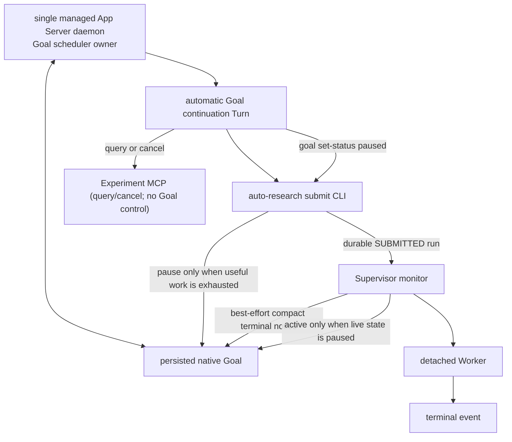

# Native App Server Goal Runtime + Experiment Supervisor

本文描述具体架构与流程。所有状态、恢复、错误处理和测试设计必须遵守
[Auto Research 设计原则](DESIGN_PRINCIPLES.md)；若具体实现与设计原则冲突，以设计原则为准。

## 1. 目标与结论

项目根目录的 `GOAL.md` 是 Goal objective 的唯一事实源。首次建立绑定时读取全文；
后续实验在 `run.json` 中只保留其内容摘要用于审计。旧 `goal.json` 和
`research/goal_contract.json` 不参与原生 Goal 或 Supervisor 控制流。

本方案让 Codex 原生 Goal 持续负责研究，Supervisor 只解决长实验的等待与恢复：

1. App Server Goal runtime 自动创建 Goal continuation。
2. Goal Turn 启动实验后保持 active，允许继续产生有价值的 continuation。
3. 只有 Agent 明确声明“只剩等待”时才切换为 `paused`；Supervisor 等本地终态。
4. 终态后 Supervisor 尽力注入轻量通知；无论注入是否成功，实时 Goal 为 `paused` 时都
   设置 `active`，`blocked` 保持不变。Codex 从 durable run 目录主动读取完整结果。
5. 完全不依赖 Desktop scheduler 或 Desktop host 私有工具。

当前 Codex 的 Goal runtime 在外部 Goal 更新为 `active` 时执行
`continue_if_idle()`，并通过 `try_start_turn_if_idle()` 创建 continuation；恢复
Thread 时也会恢复 active Goal 的 accounting 并触发 idle lifecycle。该实现细节来自
当前 Codex 源码，不应被误写为稳定的公开 API 契约；Supervisor 因而以实际
`turn/started` 事件而不是仅凭 `active` 回包判断成功。

### 1.1 参考、实现与证据边界

| 结论 | 权威或代码参考 | 本仓库实现/验证 |
|---|---|---|
| Goal 适合承载长期工作 | [OpenAI Developers: Follow a goal](https://developers.openai.com/codex/use-cases?category=automation&category=evaluation&category=sciences&task_type=analysis&task_type=code&task_type=design&team=design-engineering&team=engineering&team=operations&team=research) | 本文的 Goal/Turn/Worker 职责划分 |
| App Server 线程、Turn 与通知协议 | [Codex App Server README](https://github.com/openai/codex/blob/main/codex-rs/app-server/README.md) | [`app_server.py`](../src/auto_research/app_server.py) 的 WebSocket client 与精确 Turn 等待 |
| 原生 Goal continuation 的当前实现 | [Goal runtime source](https://github.com/openai/codex/blob/main/codex-rs/ext/goal/src/runtime.rs) | `thread/goal/set(active)` 后等待 `turn/started`；不把源码行为当公开稳定承诺 |
| 多 runtime/同一 Thread 的风险 | [Codex issue #32793](https://github.com/openai/codex/issues/32793) | managed daemon 单实例、Supervisor lock、独立 supervisor Thread |
| recoverable Goal 状态的本地策略 | [`supervisor.py`](../src/auto_research/supervisor.py) | [`test_supervisor.py`](../tests/test_supervisor.py)：自主 blocked/paused 保持、实验终态唤醒、native timeout repair、repair 拒绝才 NEEDS_USER |
| Thread 根目录与 detached 进程生命周期 | [`state_paths.py`](../src/auto_research/state_paths.py)、[`supervisor_process.py`](../src/auto_research/supervisor_process.py) | [`test_thread_state.py`](../tests/test_thread_state.py)：唯一根目录、cycle、并发与损坏绑定 |

链接的职责不同：OpenAI Developers 页面说明产品用途；App Server README 和 Goal runtime
源码说明当前协议/实现；本项目测试才是本方案回归保证。上游实现升级时，必须重新跑
Supervisor smoke test，不能只因为链接仍可访问就假设生命周期行为未改变。

## 2. 所有权模型



| 所有权 | Owner |
|---|---|
| Goal research decisions | Codex Goal Turn |
| Goal continuation scheduling | managed App Server Goal runtime |
| experiment execution | detached Worker |
| experiment wait/wake | Supervisor monitor |
| project monitor singleton | filesystem lock |

Supervisor 不构造正常的 continuation prompt，也不参与研究决策。它只在 native Goal
无法激活或已经 active 却未产生 `turn/started` 时构造一个带 run id 与故障原因的普通
repair Turn；这是可审计的恢复机制，不是第二个 scheduler。

## 3. 为什么必须使用 managed daemon

Goal runtime 的 idle check、thread map、semaphore 和 active turn accounting 是
App Server 进程内状态。多个独立 App Server 进程共享同一个 `CODEX_HOME` 时，可能
各自认为同一个 active Goal idle，并创建重复 continuation。

因此：

- daemon：`codex app-server daemon start`
- client：连接 lifecycle `socketPath` 指向的 Unix WebSocket
- 同一 Goal 的 session bootstrap、Supervisor 和实验暂停控制全部连接该 daemon。
- 禁止为该 Thread 启动另一个独立 `codex app-server --stdio`。

Supervisor 的状态身份只有 Thread ID。所有组件使用同一个解析器把它映射为
`research/supervisors/<thread-id>/`；不接受任意 `--state-root`，也不扫描其他目录猜测
Thread。Goal Turn 使用 `CODEX_THREAD_ID`，task 外运维显式传 `--thread-id`。

### 3.1 Supervisor 会话选择机制

Thread 选择只有两种动作：

1. **新建 Thread**：`session --create-thread` 调用 App Server `thread/start`，取得 ID
   后立即创建 canonical root，并原子写入 session binding；
2. **复用已有 Thread**：`session --thread-id` 验证 Thread 的 cwd 后，在该 Thread 的
   canonical root 写入绑定。

Supervisor 不按标题、最近活跃时间、Goal 文本、当前桌面焦点或目录内容搜索 Thread。
`supervisor start` 必须得到 `--thread-id`（或运行在带 `CODEX_THREAD_ID` 的 task 内），
这样重复启动始终命中同一个进程锁，不会因丢失启动输出而创建第二个 Thread。

首次创建要求调用方提供稳定 `--creation-key`，并由
`research/supervisors/.thread-bootstrap.lock` 串行化。每个 key 在
`thread_creations/` 记录 `CREATING/READY`；独立 CLI 重试复用 READY 结果，未完成记录
失败关闭，避免因 RPC 响应丢失创建静默副本。获得 Thread ID 后，
session、`metadata.json` 和首个 cycle 都写入 `research/supervisors/<thread-id>/`；后续
锁、Supervisor state、run registry 和 Worker artifacts 全部留在这个根目录。绑定损坏、
项目根不匹配、初始化未完成、目录名与内部 `thread_id` 不一致时失败关闭。

新建一个由操作者预先定义标题和 Goal 的研究会话：

```bash
uv run auto-research session \
  --project /path/to/project \
  --create-thread \
  --creation-key <stable-request-id> \
  --title "Auto Research · run-a" \
  --objective "..."

uv run auto-research supervisor start \
  --project /path/to/project \
  --thread-id <上一条输出的-thread-id>
```

复用任意已知 Thread（包括当前桌面 Thread）：

```bash
uv run auto-research session \
  --project /path/to/project \
  --thread-id <existing-thread-id> \
  --objective "..."
uv run auto-research supervisor start \
  --project /path/to/project \
  --thread-id <existing-thread-id>
```

当该 Thread 的 Goal 已完成时，普通 `supervisor start` 保持控制器终态，绝不隐式重建
或重放旧 Goal。若希望保留同一 Thread 的上下文但开启下一轮研究，使用
`supervisor restart --thread-id <id> --objective "..."`：它复用根目录、session binding
和历史 runs，显式替换 Goal，并在 `cycles/` 写入新的 cycle 记录。

多个 WebSocket connection 是同一进程内的多个订阅者，不等于多个 Goal
scheduler。`codex app-server proxy` 透传的是 WebSocket 字节流，不接收 App Server
JSONL；Supervisor 因此直接执行 WebSocket 握手，并关闭 compression 扩展。

### 3.2 Codex daemon 是什么

这里的 Codex daemon 是**本机后台常驻的 Codex App Server 进程**。它不是模型、
Goal、Turn、Supervisor 或实验 Worker。它负责持有 App Server 的进程内运行时，并
通过 Unix WebSocket 让多个客户端访问同一份 Thread/Goal 调度状态：

```text
Codex App Server daemon
├── Thread/Goal 运行时状态
├── Goal scheduler 和 idle lifecycle
├── Goal continuation Turn 创建
├── thread/goal/set(active | paused)
└── Unix WebSocket
    ├── Supervisor
    ├── Goal Turn 中的 Experiment MCP（查询/取消，不控制 Goal）
    └── session bootstrap 客户端
```

组件边界如下：

| 组件 | 职责 |
|---|---|
| daemon | App Server 运行时和 Goal 调度中心 |
| Goal | 持久化的长期研究目标 |
| Turn | 模型实际执行的一轮工作 |
| Supervisor | 监控实验终态，并请求 daemon 暂停或激活 Goal |
| Experiment Worker | 独立运行训练或评估，不属于 daemon |
| Desktop | 另一种 Codex 宿主界面，不等于本方案的 managed daemon |

当前 auto-research 使用 `codex app-server daemon start` 获取 lifecycle JSON，并连接
其中的 `socketPath`；只需要定位已有 daemon 的受限客户端使用
`codex app-server daemon version`，避免在沙箱内触碰 daemon PID lock。官方公开文档
把这类进程称为 local app-server daemon，并公开了
`codex remote-control start/stop` 生命周期入口；文档同时说明 remote-control 客户端
不替代面向自定义本地协议客户端的 `codex app-server --listen`：

- [Codex developer commands: codex remote-control](https://learn.chatgpt.com/docs/developer-commands#codex-remote-control)
- [Import in Codex CLI](https://learn.chatgpt.com/docs/import#import-in-codex-cli)

### 3.3 在 Desktop 中打开 Supervisor 专用会话

Supervisor 创建的 Thread 使用普通 Codex 持久化记录，因此出现在 Desktop 侧边栏是
正常现象。**仅在侧边栏看到它不会影响 Supervisor。**

运行中的“点击打开”不能视为受保证的只读操作。Desktop 可能对该 Thread 执行
`thread/resume`，从而让 Desktop 的独立 App Server host 加载它；这和多个客户端连接
同一个 managed daemon 不同。后者只是同一 scheduler 的多个订阅者，前者可能形成
第二个 runtime/writer，并带来以下风险：

- managed daemon 与 Desktop 对同一 Thread 争抢 writer；
- Desktop 中看到的 effective Goal 状态与 managed daemon 的实时状态不同步；
- 打开时恢复 active Goal，或用户发送消息后创建非 Supervisor 预期的 Turn；
- 用户手动暂停、恢复、修改 Goal 或中断 Turn，破坏 Supervisor 状态机假设。

因此在 Supervisor campaign 未完成时采用以下操作约束：

1. 可以在侧边栏看到专用会话，但不要点击进入。
2. 不要在该会话中发消息，也不要操作 Goal、停止按钮或重试按钮。
3. 通过 `research/supervisors/<thread-id>/supervisor/state.json`、run 终态文件和
   Supervisor CLI 查看进度。
4. campaign 完成、Supervisor 进入 `COMPLETED` 并退出后，再从 Desktop 打开会话查看。

当前实现没有阻止 Desktop 打开该 Thread 的宿主级互斥机制，因此这是一条运行安全
约束，而不是 UI 已强制执行的限制。如果误点但没有发送消息或操作 Goal，不应直接
判定 campaign 已损坏；应以 managed daemon 的 Goal 状态、Supervisor 状态和是否出现
非预期 Turn 为准进行一次对账。

## 4. 正常时序

```mermaid
sequenceDiagram
    participant D as App Server daemon
    participant G as Native Goal runtime
    participant C as Goal Turn
    participant X as auto-research CLI
    participant W as Worker
    participant S as Supervisor

    S->>D: thread/resume
    S->>D: thread/goal/set(active)
    D->>G: continue_if_idle
    G->>C: automatic Goal continuation
    C->>X: submit(command)
    X-->>S: one or more durable SUBMITTED runs
    S->>W: launch each detached Worker
    X-->>C: run_id + continuation_allowed
    C-->>D: turn/completed
    D->>G: continue_if_idle
    G->>C: another useful continuation
    C->>X: goal set-status paused (self)
    X->>D: thread/goal/set(paused)
    C-->>D: turn/completed
    Note over D,G: Goal paused only after useful work is exhausted
    W-->>S: durable terminal event
    S->>D: thread/inject_items(result)
    S->>D: thread/goal/read (authoritative live state)
    alt Goal is paused
        S->>D: thread/goal/set(active)
        D->>G: continue_if_idle
        G->>C: automatic Goal continuation
    else Goal is blocked
        Note over S,G: keep blocked; never auto-recover
    else Goal is active
        Note over S,G: evidence delivered; no status write
    else Goal is complete or limited/unknown
        Note over S,G: complete controller or enter NEEDS_USER
    end
```

显式等待交接由 Goal 自己执行 `auto-research goal set-status paused` 完成；“自己执行”指
Agent 自主决定并调用 Auto Research 状态桥，模型本身没有原生 `thread/goal/set(paused)`
工具。该 CLI 仅允许修改项目绑定的自身 Thread，并直接调用 App Server
`thread/goal/set`，不经过 MCP 审批，也不复制 per-run 等待状态。启动实验本身不触发交接。
Agent 可以经历任意多个 continuation，直到主动声明只剩等待。

## 5. 最小状态与事实模型

Supervisor 的 `state.json` 只保存三个会改变恢复动作的控制状态：

| 状态 | 含义 | 恢复动作 |
|---|---|---|
| `OPEN` | Goal cycle 未结束，当前进程可运行也可因 paused/blocked 而退出 | 实时读取 App Server、registry 和 run events 决定动作 |
| `NEEDS_USER` | Goal 自动推进暂停：repair Turn 无法建立，或遇到未知/额度状态 | Worker 仍照常启动、监控和收尾；修复后手动 `supervisor start/resume`，单次重试 Goal |
| `COMPLETED` | native Goal 已完成 | 只能用显式 `supervisor restart` 创建新 cycle |

`BOOTSTRAPPING`、`GOAL_RUNNING`、`EXPERIMENT_WAITING`、`GOAL_ACTIVATING` 等阶段不再
持久化。它们都能从进程、App Server Goal/Turn、active registry 和 run event 推导，复制
只会产生旧状态误导控制流。

Run 自身仍只有 `SUBMITTED`、`RUNNING` 和 terminal event。终态交付进度不是额外状态机，
而是 registry 上的事实字段：`terminal_injected_at` 只记录轻量通知成功。marker 保存
尚未完成的 Worker ownership；run 已终态后无论通知是否成功都可删除。通知失败写入 run
目录的诊断文件，但不阻断 Goal 唤醒；Codex 以 terminal event 和 run 目录为权威结果源。
后续人工 `start/resume` 直接根据实时 Goal 状态恢复，不把 marker 当第二套唤醒控制面。
多个终态在一次 reconciliation 中全部注入后只处理一次 Goal。

Goal 状态始终以 App Server 实时读取为准：

- `paused` 且实验终态已注入：无条件设置 `active`，不追溯暂停原因；
- `blocked`：始终保持 blocked，实验终态只注入、不激活；
- `active`：注入后继续由 native scheduler 处理；
- `complete`：交付后控制器进入 `COMPLETED`；
- `usageLimited`、`budgetLimited`：不自动轮询或恢复，进入 `NEEDS_USER`；结果已成功注入
  后可以结束该 run 的 marker 责任。用户恢复额度后手动 `supervisor start/resume`，只
  尝试一次设为 `active`，失败则重新进入 `NEEDS_USER`。
- 未知状态：进入 `NEEDS_USER` 供人工诊断；结果已经成功注入时同样可以结束 marker，
  用户修正真实 Goal 状态后手动重试。

paused 激活成功后仍必须观察同一 daemon 的新 `turn/started`。120 秒内没有执行证据时，
Supervisor 创建一个带明确原因的普通 repair Turn；仅当这个 Turn 也无法创建时进入
`NEEDS_USER`。

## 6. 实验启动与显式等待协议

`[codex].model`、approval policy 与 sandbox 只是创建或恢复 Goal task 时的 App Server
会话参数，不是实验提交或 Worker 启动的前置校验。Supervisor 不对 Codex 已提交的命令做
模型可用性预检或 Goal 状态拦截。

同一配置还必须传递 `approval_policy="never"` 与 `sandbox="workspace-write"`。
默认提交通道是 `auto-research submit` CLI，不依赖 MCP 写入确认。写入型
`submit_experiment` MCP 目前不向 Goal 暴露；它仅作为未来严格白名单自动审批方案的
TODO，不能以 `danger-full-access` 绕过确认。

`auto-research submit` 完成以下边界：

1. 校验当前 Thread 与项目专用 Thread 一致。
2. 持久化 run、按 `run_id` 的 active registry entry 和 Goal contract snapshot。
3. 将 Codex 生成的命令以 `SUBMITTED` 状态持久化；不创建 Worker 进程。
4. 返回 `goal_pause.status=NOT_REQUESTED` 和 `continuation_allowed=true`。
5. 检查 Supervisor PID、进程启动时间与 `OPERATIONAL`；若无存活 Supervisor，自动启动同一 state root 的
   Supervisor。

Supervisor 是唯一 Worker 启动者：它观察到 `SUBMITTED` 后调用 Runner launch，随后
持有并监控 detached Worker。Goal Turn、MCP server 和普通 Codex shell 都不得绕过
Supervisor 直接启动长实验。

提交可附带 advisory `gpu_ids` 和 `expected_artifacts`。Supervisor 不据此拒绝 Codex 动作，
但 run provenance 能显示资源归属；Worker 将进程终态与 `artifact_validation.json` 分开，
缺失 metrics 或预期产物作为证据交给 Codex，而不是混入进程退出状态。

提交只保留执行所需的技术校验：command 非空、worktree 存在、timeout 为正数、Thread/cycle
归属明确。worktree 可以位于项目目录之外，timeout 不设置任意七天上限，Codex 生成的 shell
命令不经过 executable allowlist；这些研究与资源决策不属于 Supervisor。

提交后 Agent 继续所有可并行工作。只有只剩等待时调用 `auto-research goal set-status paused`；
该 CLI 校验调用者只能修改项目精确绑定的自身 Thread，并同步设置 Goal `paused`。Experiment MCP
不参与该控制面，避免平台 MCP 审批取消影响 Goal 生命周期。

`auto-research wait <run_id>` 是独立的同步观察入口：它只读取同一 durable terminal event，
不修改 Goal、不启动 Worker，也不删除 registry 的终态交付责任。因此它与 Goal 状态桥
并存不构成第二套 Goal control plane。它适合短时同步等待和人工诊断；长实验默认使用
`goal set-status paused` 交还 Turn，由 Supervisor 独立监控并在终态后恢复 Goal。

## 7. 实验恢复协议

Supervisor观察到任一 terminal event 后（成功、失败、超时、取消与 LOST 完全等价）：

1. 校验 run 的 `codex_thread_id`。
2. 在 registry entry 记录终态交付进度；读取结果和取消操作不能删除该 entry。
3. 用 `thread/inject_items` 尽力写入只含 `run_id`、`status`、`result_dir` 的轻量通知；
   成功时记录 `terminal_injected_at`。metrics、artifact validation、错误和日志不进入
   Thread 上下文，由 Codex 从 `result_dir` 主动读取。
4. 批量读取实时 Goal：paused 才激活，blocked 不激活；不根据本地 marker 或历史原因分支。
5. paused 激活成功后等待新的 `turn/started`，不能依据紧随其后的一次旧 `paused` 读取退出。
6. 通知注入失败只写 `terminal_injection_error.json`，仍继续 paused/blocked/active/
   complete 的对应动作并结束 marker；不会进入 `NEEDS_USER`。完整结果始终由 terminal
   event 和 run 目录保证，不依赖 Thread 注入。其他 run 继续独立监控。
7. Supervisor 启动时扫描 Thread root 下所有无终态的 `SUBMITTED/RUNNING` run，将缺失的
   registry entry 补回；确认 Worker 已退出后写入 `LOST`。Worker 身份无法核验、run
   元数据损坏或 child 清理无法确认时不得猜测终态，而是进入 repair/`NEEDS_USER`。
8. `NEEDS_USER` 只停止没有新终态依据的 Goal continuation/repair 自动化，不停止 durable
   run 的启动、监控、deadline reconciliation、终态注入和安全清理。若终态到达时实时
   Goal 为 paused，仍按核心规则尝试一次激活；所有 active run 收尾后才退出。

Worker 的 PID 与启动时间匹配但长期存活，不等于运行健康。Supervisor 同时读取实验的
明确 deadline、heartbeat 和进程身份；超过 `timeout_s + event_grace_s` 后，即使 Worker
仍存活也必须先核验并停止 child/Worker，确认清理完成后才提交 `TIMEOUT`。身份不明或清理
失败时不写伪终态。

### 容错与修复门槛

本方案只把以下情况视为必须修复的控制面故障：

- Supervisor 自行无限重启、无限激活或无限创建 continuation；
- durable run、终态结果或 Goal 唤醒责任丢失，导致流程永久停滞；
- Worker/child 仍存活，却已提交 `CANCELLED/LOST` 并释放 ownership；
- 同一 run 被重复启动，或多个 Supervisor 同时取得相同控制权；
- Supervisor 异常退出且错误无法交给 Codex 或人工恢复。

不追求跨 App Server、文件系统和进程 side effect 的严格 exactly-once。一个残留请求造成
一次额外激活/continuation，或幂等重试造成一次重复结果注入，可以接受；请求或 marker
处理后必须收敛，不能自动反复发生。不得为消除这种单次重复增加新的 Supervisor 控制状态。

### 普通 Turn fallback

实验终态后，Supervisor 只对实时 `paused` 调用 `thread/goal/set(active)` 并验证返回状态。
如果 App Server 拒绝 paused 激活或请求报错，当前实现会立即
创建一个**窄范围、可审计的普通 repair Turn**，把 run id 和激活失败原因交给 Codex。

`thread/goal/set(active)` 已成功、但 120 秒内仍未收到原生 `turn/started` 时，当前实现：

1. 再次读取 Thread，确认不存在 active/in-progress Turn。
2. 调用 `turn/start`；该请求同时验证 App Server transport、模型认证和账户额度。
3. 将刚注入的 run id、终态和 artifact 路径作为普通用户输入，要求
   Codex 分析错误并继续研究。
4. 写入 `recovery_turn_id`、触发原因和结果，防止重复创建 fallback Turn。

该 fallback 不得用于并发抢占活跃 Goal Turn，也不能绕过 `usageLimited`、
`budgetLimited`、refresh-token 失败或其他模型侧拒绝；这些情况下普通 Turn 同样无法
执行，应保留终态和失败诊断等待认证/额度恢复。

### 排障：已登录但 App Server refresh token 失败

桌面插件、Codex CLI 和已经运行的 App Server daemon 是不同的本地认证生命周期。
`codex login status` 显示已使用 ChatGPT 登录，只证明当前 CLI 的持久凭证可读；它**不**
保证一个早于重新登录启动的 daemon 已经丢弃内存中的旧 refresh token。典型终态是
Goal activation 后的普通/原生 Turn 报："access token could not be refreshed because you
have since logged out or signed in to another account"。

按以下顺序排查和恢复：

1. 记录失败 run 的终态、`terminal_delivery_error`、`goal_wake_error` 和 App Server Turn
   error；不要因认证问题删除 run 或 marker 事实。
2. 运行 `codex login status`，确认运行 Supervisor 的同一 OS 用户和 `CODEX_HOME` 使用
   ChatGPT 登录。凭证通常位于 `CODEX_HOME/auth.json` 或系统 keychain。
3. 检查 `codex app-server daemon version`。若 daemon 比 CLI 旧，或显示非 managed，先
   关闭 Desktop/IDE 对同一控制 socket 的宿主，再重启**同一用户**的 managed daemon：
   `codex app-server daemon restart`。
4. 若 restart 报 "app server is running but is not managed"，不要启动第二个独立
   `app-server --stdio` 与其竞争。先识别占用 control socket 的旧 App Server；在用户
   确认其桌面/IDE 已关闭后停止该精确进程，再用 managed CLI 启动 daemon。若提示
   standalone install 缺失，按官方安装器恢复受管 CLI 后再启动。
5. restart 后再次检查 daemon version 与 login status，并先验证一个短 Goal/普通 Turn；
   成功前不要重跑长实验。
6. 仍失败时，执行 `codex logout` 后 `codex login`，在浏览器中确认当前订阅账户，然后
   再重启 daemon。

认证、额度和 transport 是三个独立条件：daemon 可连接不等于 refresh token 有效；token
有效不等于仍有 `usageLimited` 之外的模型额度。普通 Turn fallback 不能绕过这两类拒绝。

## 8. 重启恢复

Supervisor启动顺序以实时 Goal 和 durable run 事实为准：

- 存在 active run：不根据 registry marker 改写 Goal；`active` 继续原生 continuation，
  `paused/blocked` 保持原状态，同时 Supervisor 继续监控 Worker。
- 不存在 active run：直接 `thread/resume`。已有 active Goal 由 daemon 自动续跑；
  只有首次创建、尚无控制器状态的初始 paused Goal 由 Supervisor 激活。
- 已有 in-progress Turn：从 resume/read 返回的 Turn 列表取得 ID并继续等待终态。
- Goal complete：Supervisor结束。
- blocked/paused Goal 且无 active run：保持原生状态并退出 monitor，不复制一份本地状态。
- blocked Goal 即使实验结束也不自动恢复；paused Goal 只要实验结束就激活，不判断暂停原因。
- usageLimited/budgetLimited：进入 `NEEDS_USER` 并退出，不轮询额度。额度恢复后由用户
  手动 `supervisor start/resume`；该操作尝试一次 `thread/goal/set(active)`，失败则重新
  进入 `NEEDS_USER`，不得自动循环。
- 若限额错误发生时实时 Goal 仍显示 `paused`，手动 `start/resume` 同样只尝试一次
  `active`；终态已经注入时不依赖旧 marker 才能恢复。
- `NEEDS_USER` 时若仍存在 `SUBMITTED/RUNNING` run，Supervisor 保持运行直至全部终态；
  该状态不得成为跳过 Worker reconciliation 的条件，也不覆盖终态对实时 paused Goal 的
  一次唤醒规则。

普通 Goal Turn 由 `supervisor.goal_turn_timeout_s` 提供无可观察进展上限，默认 1800 秒。
Thread 中该 Turn 的结构化快照发生变化时刷新期限；健康但耗时较长的 Turn 不会仅因总运行
时间超过 1800 秒而被中断。持续无进展后 Supervisor 先把 active Goal 暂停并中断精确
Turn，再创建一次 repair Turn；repair Turn 自身持续无进展只中断并进入 `NEEDS_USER`，不得
递归创建 repair。进程级 fatal repair 等待采用相同规则，并在等待期间继续 reconciliation
durable runs。repair 失败只停止 Codex 自动修复；若仍有 active run，Supervisor 必须继续
监控到全部终态。终态恢复创建的 repair Turn 必须重新接入同一个 watchdog，不能无人监管。

## 9. 持久文件

| 文件 | 用途 |
|---|---|
| `<thread-root>/metadata.json` | 人类可读名称、项目与 Thread 归属；仅用于浏览和审计，不参与选路 |
| `<thread-root>/supervisor_session.json` | Thread 与项目的精确绑定；创建后立即原子持久化 |
| `<thread-root>/cycles/<cycle-id>.json` | 同一 Thread 上每轮 Goal 的目标与开始时间；历史 runs 不随 cycle 清空 |
| `<thread-root>/supervisor/state.json` | 只保存 `OPEN`、`NEEDS_USER`、`COMPLETED` 及 repair Turn 身份；不保存运行阶段 |
| `<thread-root>/supervisor/active_experiments.json` | 按 `run_id` 保存所有待启动、运行中及待完成终态交付的 run；不是并发限制 |
| `<thread-root>/supervisor/goal_status_requests/<request-id>.json` | sandboxed Goal 请求 Supervisor 代为执行 `thread/goal/set` 的队列项 |
| `<thread-root>/supervisor/goal_status_acks/<request-id>.json` | 对应 request id 的执行结果，避免并发请求互相覆盖 |
| `<thread-root>/runs/<run_id>/...` | Worker 和终态事实 |

其中 `<thread-root>` 恒等于 `research/supervisors/<thread-id>/`，不是配置参数。

Supervisor 不限制 active run 数量。串行、并行和 GPU 分配属于 Codex/`GOAL.md` 的研究
策略；Supervisor 逐 run 启动、监控、取消、交付终态。

`state.json` schema 为 v3，实现只定义、读取和写入当前字段，不包含历史 schema 的
迁移、清理或拒绝分支。

## 10. 验证门槛

单元测试必须证明：

- 新建、adopt、restart、同 Thread 多 Goal cycle、重复启动、损坏绑定与并发 bootstrap
  都只命中一个 canonical Thread root；

- 无活动实验时，Goal Turn 自主 blocked/paused 后不会被自动激活；Supervisor 重启也
  不得覆盖该状态；
- 已启动 Worker 即使遇到 blocked/paused 仍监控到终态；paused 只激活一次，blocked 不激活；
- 多个 run 可同时登记和启动；一个 run 的查询、取消或终态不能删除其他 run；
- 终态激活已经创建 Goal Turn但持久 Goal 读取仍短暂为 paused 时，Supervisor 不得退出；
- 提交时 Supervisor 已死亡会自动启动，并以 PID+start-time 和 `OPERATIONAL` 作为接管成功；
- native `turn/started` 超时时创建 repair Turn；仅 repair Turn 也被拒绝时进入
  `NEEDS_USER`；
- Goal Turn 持续无进展时会有界中断并只创建一个 repair Turn；可观察进展会刷新期限，
  repair Turn 卡死不递归；
- fatal repair 失败时已有 Worker 仍监控到终态；终态创建的 repair Turn 会重新接入
  watchdog，Supervisor 不得提前退出；
- paused Goal 激活后观察到 native `turn/started`；
- run 终态后尽力注入轻量通知；注入失败仍恢复 paused Goal，blocked Goal保持 blocked；
- usageLimited/budgetLimited 不自动轮询；恢复额度后手动 start/resume 能重新产生 Goal
  continuation，失败只重试一次；
- 终止 Worker/child 失败时不提交 `CANCELLED/LOST`，不释放 run ownership；
- 缺失 registry entry 的 unfinished run 会被重新接管；Worker 身份无法核验或 run
  元数据损坏时 fail closed，不能伪造 LOST；
- Supervisor 异常退出、run/registry 提交中断和进程身份异常都不能留下永久无人处理的
  `SUBMITTED/RUNNING` run；
- `NEEDS_USER` 期间仍启动、监控并收尾 durable runs；新终态仍唤醒实时 paused Goal；
- alive Worker 超过 deadline 时核验并清理 child/Worker 后写 `TIMEOUT`，清理失败不写终态；
- 第二次 Goal continuation 能继续并完成；
- Supervisor-owned run 不启动旧 Listener；
- 启动 run 后至少允许两次 native continuation；
- Goal 状态桥只修改精确绑定的自身 Thread，不向 registry 复制等待状态。

真实 daemon smoke test 还需验证：

1. 不发送 `turn/start`，仅 `set(active)` 即出现 `turn/started`。
2. active Turn 内 set(paused) 后，Turn结束不再 continuation。
3. set(active) 后重新出现 Goal continuation。
4. daemon重启后 active/paused run 恢复符合预期。

参考入口与证据层级见 [1.1 参考、实现与证据边界](#11-参考实现与证据边界)。
