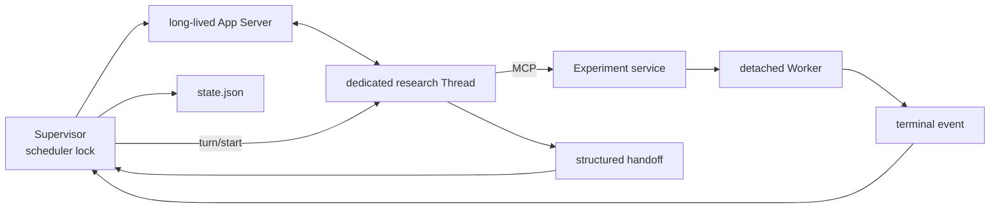
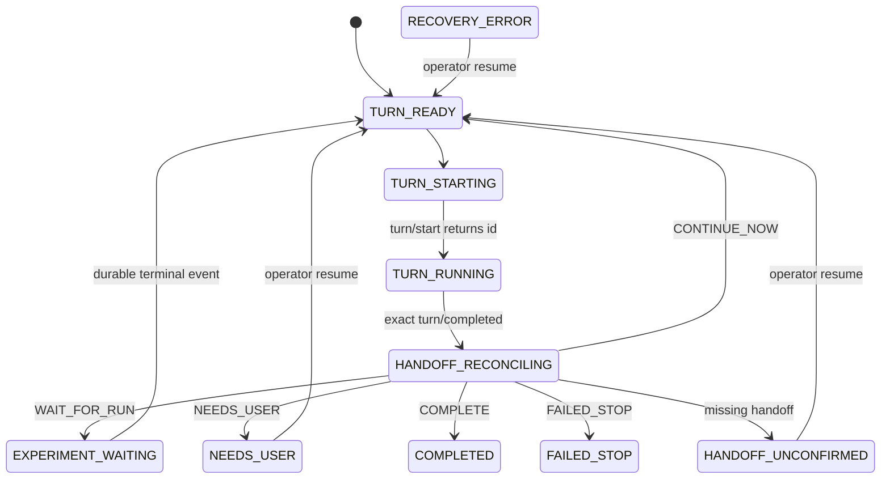

# Auto Research App Server Supervisor / Scheduler

## 1. 目标

Supervisor 解决一个窄而关键的问题：长实验结束后，如何确定性地让 Codex 在同一
研究上下文中继续，而不依赖 Desktop Goal scheduler 的隐含行为。

设计约束：

1. Codex 负责研究决策；Supervisor 只调度生命周期。
2. 长实验期间没有模型轮询或悬挂 Turn。
3. 一个项目默认一个专用 Thread、一个 writer、一个活动实验。
4. 所有跳转有 durable state，可在进程退出后审计。
5. 不从自然语言 final message 猜控制动作。

## 2. 控制面与执行面



Supervisor 不调用 Desktop host bridge，也不以 `Goal=active` 作为充分唤醒条件。
专用 Thread 可在 Desktop 查看，但 Supervisor 持锁期间不应由 Desktop 同时启动
Turn。

## 3. 状态机



当前 v0.4 对启动后遗留的 `TURN_STARTING`、`TURN_RUNNING`、
`HANDOFF_RECONCILING` 采取 fail-closed：进入 `RECOVERY_ERROR`，避免在无法确认是否
已经创建 Turn 时重复 `turn/start`。后续版本可通过 `thread/read(includeTurns=true)`
加入 attempt reconciliation。

## 4. 结构化 handoff

Turn prompt 带唯一 `turn_attempt_id`。MCP 工具
`submit_supervisor_handoff` 原子写入：

```json
{
  "schema_version": 1,
  "turn_attempt_id": "attempt-...",
  "thread_id": "019f...",
  "turn_id": "turn-...",
  "action": "WAIT_FOR_RUN",
  "run_id": "run-v17-...",
  "summary": "training started and startup was validated",
  "reason": "terminal metrics are the only remaining dependency"
}
```

校验规则：

- attempt 必须等于 `active_turn.json`；
- 每个 attempt 只能提交一个语义一致的 handoff；
- `WAIT_FOR_RUN` 必须提供存在的 run；
- run 的 `codex_thread_id` 必须等于 Supervisor Thread；
- 缺少 handoff 进入人工停点，不自动生成下一个 Turn；
- 连续 `CONTINUE_NOW` 最多一次，防止无实验空转。

## 5. 实验交接

Supervisor-owned Turn 调用 `start_experiment` 时：

1. `CODEX_THREAD_ID`/显式 thread 与项目绑定一致；
2. run 写入 `codex_thread_id`；
3. `wake_enabled=false`，不创建 Listener；
4. MCP 返回 `scheduler=app_server_supervisor`；
5. Codex 验证启动稳定后提交 `WAIT_FOR_RUN`；
6. Turn 完成，Supervisor 在本地等待 terminal event；
7. 终态结果放进下一 Turn prompt，再显式 `turn/start`。

实验失败、超时、取消和 LOST 都会创建分析 Turn；它们是研究证据，不自动等价于
整个 Goal 失败。

## 6. 持久文件

| 文件 | 用途 |
|---|---|
| `research/codex_session.json` | 项目专用 Thread 绑定 |
| `research/supervisor/state.json` | 当前 scheduler 状态、run、Turn、handoff |
| `research/supervisor/active_turn.json` | 当前 attempt 与精确 Turn ID |
| `research/supervisor/handoffs/*.json` | Agent 的不可猜测控制决定 |
| `research/supervisor/process.json` | detached Supervisor PID 记录 |
| `research/runs/<run_id>/...` | Worker、heartbeat、metrics、terminal event |

这些文件描述持久事实，不应单独用来声称 Desktop UI 当前 active。Supervisor 的
执行事实来自它自己的 App Server Turn lifecycle。

## 7. 故障与恢复

| 故障 | v0.4 行为 |
|---|---|
| 第二个 Supervisor 启动 | 非阻塞 lock 立即拒绝 |
| Turn 完成但没有 handoff | `HANDOFF_UNCONFIRMED` |
| run/thread 不匹配 | 拒绝 handoff或 `RECOVERY_ERROR` |
| Worker/Turn 宿主退出 | Worker setsid 继续；状态保留 |
| App Server approval/user input | 默认 decline/cancel，不隐式扩大授权 |
| 等待实验时 Supervisor 重启 | 从 `EXPERIMENT_WAITING` 与 run_id 继续 |
| 模糊的 in-flight Turn 重启 | fail-closed，等待人工对账 |

人工确认后运行 `auto-research supervisor resume`，再重新启动 foreground 或
detached Supervisor。`resume` 不负责终止冲突 writer，操作者必须先解决冲突。

## 8. 后续增强

- 用 `thread/read(includeTurns=true)` 对账 `turn_attempt_id`，安全恢复启动响应丢失。
- 增加 lease heartbeat 与进程存活诊断。
- 将 approval/user-input 持久化为精确的 `NEEDS_USER` 请求。
- 增加显式 shutdown/interrupt 管理命令。
- 在单实验语义稳定后，再设计多个 run 的 fan-out/fan-in handoff。

官方协议参考：

- [App Server lifecycle](https://learn.chatgpt.com/docs/app-server#lifecycle-overview)
- [App Server Turns](https://learn.chatgpt.com/docs/app-server#turns)
