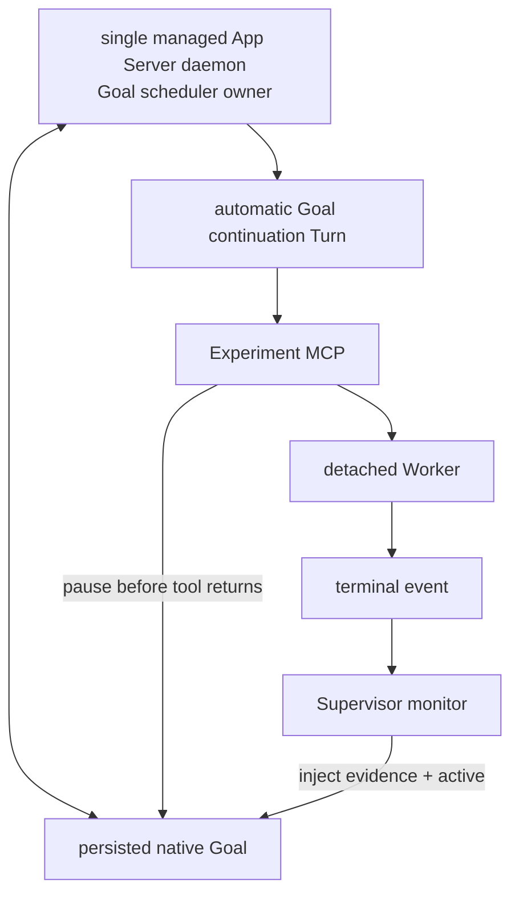
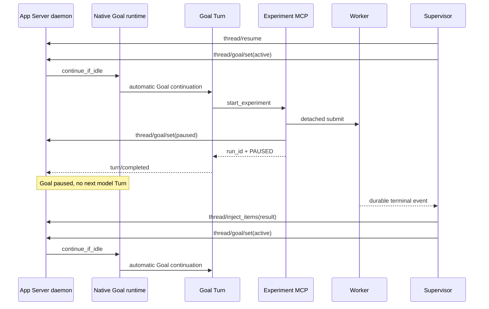
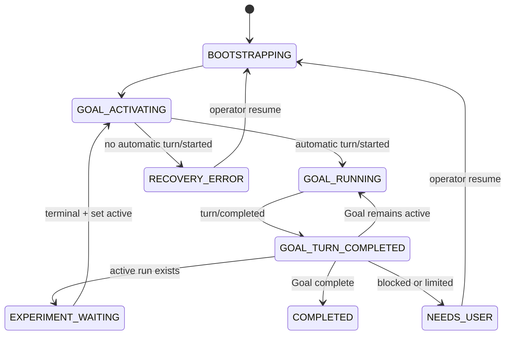

# Native App Server Goal Runtime + Experiment Supervisor

## 1. 目标与结论

本方案让 Codex 原生 Goal 持续负责研究，Supervisor 只解决长实验的等待与恢复：

1. App Server Goal runtime 自动创建 Goal continuation。
2. Goal Turn 启动实验后，在本 Turn 结束前切换为 `paused`。
3. Worker detached 运行；Supervisor 只等待本地终态事件。
4. 终态后 Supervisor 设置 `active`，Goal runtime 自动创建下一 Turn。
5. 完全不依赖 Desktop scheduler 或 Desktop host 私有工具。

当前 Codex 的 Goal runtime 在外部 Goal 更新为 `active` 时执行
`continue_if_idle()`，并通过 `try_start_turn_if_idle()` 创建 continuation；恢复
Thread 时也会恢复 active Goal 的 accounting 并触发 idle lifecycle。

## 2. 所有权模型

| 所有权 | Owner |
|---|---|
| Goal research decisions | Codex Goal Turn |
| Goal continuation scheduling | managed App Server Goal runtime |
| experiment execution | detached Worker |
| experiment wait/wake | Supervisor monitor |
| project monitor singleton | filesystem lock |

Supervisor 不是 Thread writer，也不构造 continuation prompt，更不调用
`turn/start`。

## 3. 为什么必须使用 managed daemon

Goal runtime 的 idle check、thread map、semaphore 和 active turn accounting 是
App Server 进程内状态。多个独立 App Server 进程共享同一个 `CODEX_HOME` 时，可能
各自认为同一个 active Goal idle，并创建重复 continuation。

因此：

- daemon：`codex app-server daemon start`
- client：连接 lifecycle `socketPath` 指向的 Unix WebSocket
- 同一 Goal 的 session bootstrap、Supervisor 和实验暂停控制全部连接该 daemon。
- 禁止为该 Thread 启动另一个独立 `codex app-server --stdio`。

Supervisor 默认使用 `research/supervisor_session.json` 创建或复用独立 Thread。
`--adopt-session` 才允许复用 `research/codex_session.json`；是否接管现有会话必须由
操作者显式选择，不能根据项目已有绑定静默决定。

多个 WebSocket connection 是同一进程内的多个订阅者，不等于多个 Goal
scheduler。`codex app-server proxy` 透传的是 WebSocket 字节流，不接收 App Server
JSONL；Supervisor 因此直接执行 WebSocket 握手，并关闭 compression 扩展。

## 4. 正常时序

暂停必须在 MCP tool 返回前完成。若等到 `turn/completed` 后才暂停，Goal runtime
可能已经在 Turn 结束的 idle lifecycle 中启动下一 continuation。

## 5. 状态机

`GOAL_ACTIVATING` 的成功条件不是读回 `active`，而是同一 daemon 发出新的
`turn/started`。Supervisor随后只观察该 Turn 的 `turn/completed`。

## 6. 实验暂停协议

`start_experiment` 完成以下原子边界：

1. 校验当前 Thread 与项目专用 Thread 一致。
2. 持久化 run、active marker 和 Goal contract snapshot。
3. 启动 detached Worker。
4. 通过 daemon WebSocket 设置当前 Goal `paused`。
5. 写 `experiment_handoff.json`。
6. 返回 `goal_pause.status=PAUSED`。

暂停失败不会伪装成功：工具写入
`runs/<run_id>/goal-pause-error.json` 后抛出包含 `run_id` 的错误。实验已经启动，
Codex此时不得重提实验或结束当前 Turn，应先修复暂停控制或取消该 run。

## 7. 实验恢复协议

Supervisor观察到 terminal event 后：

1. 校验 run 的 `codex_thread_id`。
2. 清除匹配的 `active_experiment.json`。
3. 用 `thread/inject_items` 写入不可信的终态 JSON、artifact path 和日志尾部。
4. 设置 Supervisor 状态 `GOAL_ACTIVATING`。
5. `thread/goal/set(active)`。
6. 等待自动 `turn/started`，不得调用 `turn/start` 补救。

如果 120 秒内没有自动 Turn，进入 `RECOVERY_ERROR`。这样可以暴露 feature、daemon
ownership 或 runtime 状态问题，而不会偷偷降级成普通 Turn。

## 8. 重启恢复

Supervisor启动顺序有意区分 active run：

- 存在 active run：先通过 Goal state API 设置 `paused`，再 `thread/resume`，避免
  resume active Goal 时自动 continuation；随后恢复等待。
- 不存在 active run：直接 `thread/resume`。active Goal 会由 daemon 自动续跑；
  paused 初始 Goal由 Supervisor 显式设为 active。
- 已有 in-progress Turn：从 resume/read 返回的 Turn 列表取得 ID并继续等待终态。
- Goal complete：Supervisor结束。
- blocked/usageLimited/budgetLimited：进入 `NEEDS_USER`。

## 9. 持久文件

| 文件 | 用途 |
|---|---|
| `research/supervisor_session.json` | 默认 Supervisor 专用 Thread 绑定 |
| `research/codex_session.json` | 可选 `--adopt-session` 的既有 Thread 绑定 |
| `research/active_experiment.json` | 当前非终态 run 提示 |
| `research/supervisor/state.json` | monitor 状态、Turn ID、run、终态结果 |
| `research/supervisor/active_experiment.json` | Supervisor 会话当前非终态 run |
| `research/supervisor/experiment_handoff.json` | start tool 已暂停 Goal 的证据 |
| `research/runs/<run_id>/...` | Worker 和终态事实 |

旧 Listener 的 `research/active_experiment.json` 与 Supervisor marker 分离。这样独立
Supervisor 会话可以在另一组 GPU 上运行一个实验，而不会接管已有 Desktop run；但
每个 Supervisor 仍只有一个 active run，评估 campaign 仍需串行。

## 10. 验证门槛

单元测试必须证明：

- Supervisor代码路径从不调用 `turn/start`；
- paused Goal 激活后观察到 native `turn/started`；
- run 终态后注入结果并重新 active；
- 第二次 Goal continuation 能继续并完成；
- Supervisor-owned run 不启动旧 Listener；
- pause handoff 与 run/thread 精确绑定。

真实 daemon smoke test 还需验证：

1. 不发送 `turn/start`，仅 `set(active)` 即出现 `turn/started`。
2. active Turn 内 set(paused) 后，Turn结束不再 continuation。
3. set(active) 后重新出现 Goal continuation。
4. daemon重启后 active/paused run 恢复符合预期。

参考：

- [App Server README](https://github.com/openai/codex/blob/main/codex-rs/app-server/README.md)
- [Goal runtime source](https://github.com/openai/codex/blob/main/codex-rs/ext/goal/src/runtime.rs)
- [多 App Server Goal 并发问题](https://github.com/openai/codex/issues/32793)
