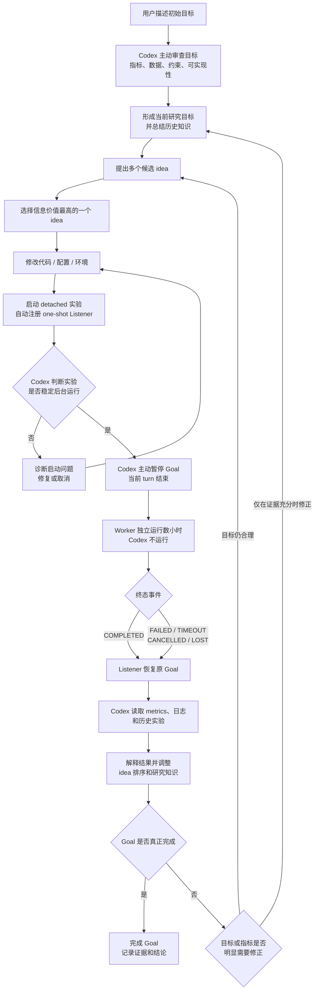
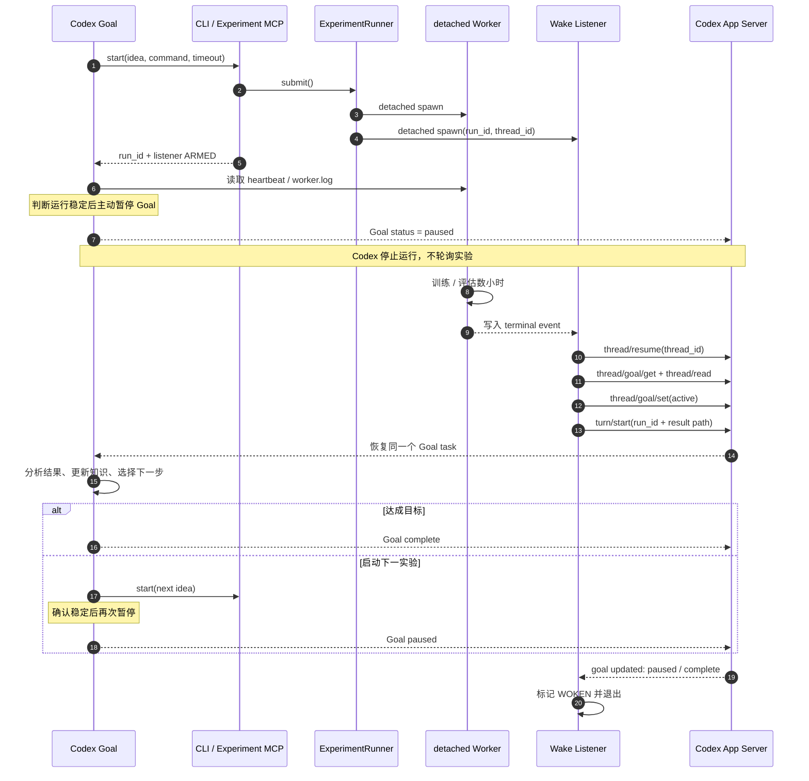
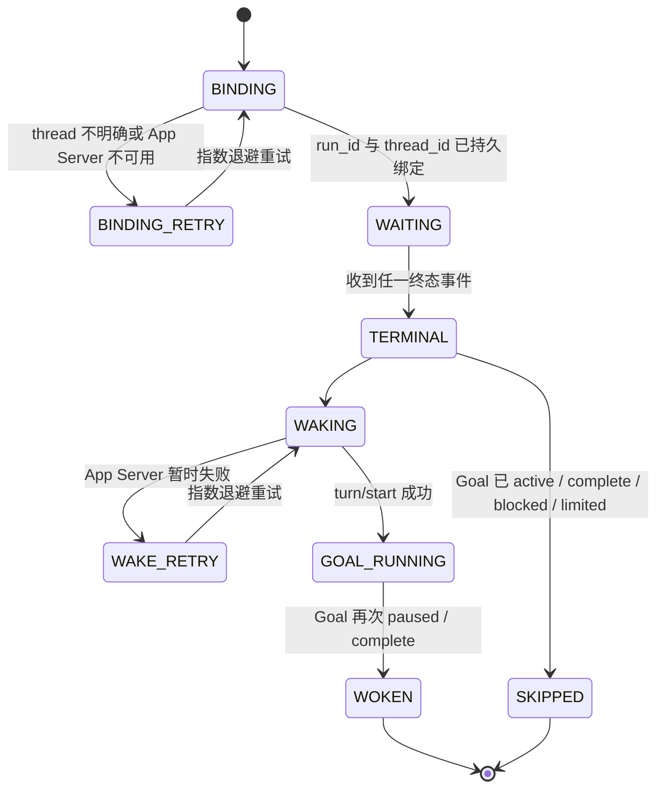

# v0.3 当前方案：Codex Goal + One-shot Wake Listener

## 1. 设计目标

Codex Goal 保留完整研究自主权；外部代码只解决长实验与暂停 Goal 之间的异步断点。

核心原则：

1. Codex 决定研究内容和 Goal 生命周期。
2. Worker 独立于 Codex turn 执行。
3. Goal 暂停期间不运行模型、不查询 `RUNNING`。
4. 终态事件只触发一次对原 Goal 的恢复。
5. 不引入 Harness cycle、阶段编排或外部停止判断。

## 2. 当前架构图

```mermaid
flowchart TD
    U["用户研究要求"] --> G["Codex Goal<br/>唯一研究 Agent"]

    subgraph C["Codex 控制面"]
        direction TB
        G
        AS["Codex App Server<br/>thread / Goal / turn"]
        FT["恢复后的 follow-up turn"]
        AS --> FT --> G
    end

    subgraph E["实验执行面"]
        direction TB
        API["auto-research start<br/>或可选 Experiment MCP"]
        R["ExperimentRunner<br/>持久化并提交"]
        W["detached Worker<br/>训练 / 评估"]
        L["one-shot Goal Wake Listener<br/>只恢复一次"]
        API --> R
        R --> W
        R --> L
    end

    subgraph P["持久状态"]
        direction TB
        RUN["run.json / heartbeat.json<br/>metrics.json / worker.log"]
        EVENT["terminal event<br/>completed / failed / timeout<br/>cancelled / lost"]
        WAKE["wake.json<br/>run_id → thread_id"]
    end

    G -->|"选择 idea 并启动"| API
    G -.->|"确认 Worker 稳定后<br/>主动暂停 Goal"| AS
    W --> RUN
    W --> EVENT
    L --> WAKE
    EVENT -->|"文件事件"| L
    L -->|"thread/resume<br/>Goal active<br/>turn/start"| AS
```

图中的关键边界是：Codex 负责“为什么实验、实验什么、何时暂停、结果意味着什么”；Listener 只负责“终态出现后，让同一个 Goal task 再运行起来”。

## 3. 组件边界

| 组件 | 负责 | 不负责 |
|---|---|---|
| Codex Goal | 目标优化、资料研究、idea、代码、实验解释、暂停与完成 | 后台进程保活 |
| CLI / Experiment MCP | 确定性提交、结果读取、取消 | 研究策略、Goal 状态 |
| ExperimentRunner | run 持久化、并发边界、detached Worker 启动 | 训练内容、idea 选择 |
| detached Worker | 执行命令、heartbeat、metrics、终态 | 唤醒 Codex |
| Goal Wake Listener | run/thread 绑定、等待终态、恢复一次 Goal | cycle、idea、指标判断 |
| Codex App Server | thread/Goal 持久状态和 turn 执行控制面 | 实验执行 |

依赖方向保持单向：Codex 可以调用实验入口；实验执行层不调用研究策略；Listener 只通过 App Server 恢复 Codex。

## 4. 自动研究闭环流程图

失败终态也进入同一个闭环。实验被 kill、代码异常或缺少指标并不等于研究结束，而是交还 Codex 决定 repair、retry、换 idea 或停止。

## 5. 单次实验闭环时序图

Listener 只显式创建一个恢复 turn。Goal 后续若产生原生续 turn，Listener 只保持 App Server 执行宿主存活，不负责创建研究循环。

## 6. 运行状态与所有权

`WAITING` 期间只有 Worker 和本地 Listener 运行；Codex Goal、推理模型和 MCP 状态查询均不运行。

## 7. thread 绑定

绑定优先级：

1. `wake.json` 已持久化的 `thread_id`。
2. CLI/MCP 显式 `thread_id`。
3. 当前 Codex 工具环境的 `CODEX_THREAD_ID`，并通过 App Server 再验证。
4. `thread/list(cwd=<project>)` 中最近的 active/paused Goal。

自动发现只接受与 run 创建时间接近的候选。多个候选时间相同或候选过旧时，Listener 保持 `BINDING_RETRY`，等待显式绑定，不采用“最新历史会话”猜测。

`run_id -> thread_id` 写入每个 run 的 `wake.json`，之后恢复不再重新选择任务。

## 8. 为什么 Listener 需要保持 App Server 存活

`thread/goal/set(status=active)` 只改变持久 Goal 状态；`turn/start` 才开始生成。通过 stdio 启动的 App Server 同时是本次恢复执行的宿主，如果在 `turn/start` 后立即终止，可能留下一个 UI 中显示 active、实际没有执行进程的任务。

因此 Listener 在发起恢复 turn 后继续读取 App Server 事件，直到 Goal 再次进入：

- `paused`
- `complete`
- `blocked`
- `usageLimited`
- `budgetLimited`

这不是模型轮询，不产生额外 token。Goal 已进入静止状态但 App Server 缺少 `turn/completed` 时，Listener 只保留一个有限的收尾窗口，不永久占用执行宿主。

## 9. 幂等与竞态

每个 run 使用 `.wake-listener.lock` 保证只有一个 Listener。`wake.json` 记录：

- `thread_id`
- `state`
- `terminal_status`
- `wake_turn_id`
- `attempts`
- `last_error`

恢复前读取 `thread/read`：

- thread 已 active 且没有本 Listener 的 `wake_turn_id`：认为用户或其他恢复器已接管，标记 `SKIPPED`。
- Goal complete/blocked/limited：不自动激活，标记 `SKIPPED`。
- Listener 在 `turn/start` 后断线：保留 `wake_turn_id`；重启时优先附着已有 active turn，不创建第二个 turn。
- `recover-wakes` 只恢复带有 `runtime_version=3` 和 `wake_enabled=true` 的 run，不接管 v0.1/v0.2 历史实验。

## 10. 失败模型

| 故障 | 行为 |
|---|---|
| 终端或 Codex turn 关闭 | Worker 和 Listener 均为 detached，不受影响 |
| 实验失败/超时/被 kill | 写终态或最终进入 LOST，然后照常唤醒 Goal |
| App Server 暂时不可用 | 本地指数退避重试，不调用模型 |
| Listener 崩溃/机器重启 | `recover-wakes` 从 run/wake 文件恢复 |
| thread 候选不明确 | 不猜测；持续 `BINDING_RETRY` 或显式 `--thread-id` |
| 重复终态文件事件 | 单实例锁和终态锁阻止重复 turn |
| Goal 已被人工恢复 | thread active 时 Listener 跳过重复唤醒 |

## 11. 与历史架构方案对比

### 11.1 主体职责对比

| 方案 | 主研究 Agent | 实验等待 | Goal 暂停 | Goal 恢复 | turn 推进 | 研究自由度 | 工程复杂度 | 结论 |
|---|---|---|---|---|---|---|---|---|
| Python Director + Codex SDK | Python Director | Director/Runner | 不使用原生 Goal | Director 创建 SDK run | Director | 中 | 高 | 适合无 UI、中心化编排，不符合本项目“Codex 是主 Agent”目标 |
| Agents SDK Director + Codex MCP Server | Agents SDK Director | 外层 Agent | 外层管理 | 外层管理 | 外层 handoff | 高但分散 | 最高 | 适合多 specialist 和 trace，本项目不需要第二个主 Agent |
| v0.1 完整 GoalHarness | Harness 与 Codex 分担 | Harness | Harness | Harness | Harness cycle | 较低 | 高 | 稳定性逻辑集中，但固定流程侵入研究决策 |
| v0.2 自主 Codex + 完整 Harness | Codex | Harness | Harness 强制 | Harness | Harness cycle | 高 | 高 | 研究自主性改善，但生命周期和状态机仍过重 |
| v0.3 one-shot Listener | Codex Goal | detached Listener | Codex 主动 | Listener 只恢复一次 | 原生 Goal + 一次 `turn/start` | 最高 | 低 | 当前方案，保留闭环所需的最小外部能力 |

### 11.2 长实验等待方式对比

| 等待方式 | 实验期间 Codex turn | 模型轮询 | 自动恢复 | 主要问题 | 是否采用 |
|---|---|---|---|---|---|
| `run_experiment_and_wait` 阻塞 MCP | 持续打开数小时 | 无 | 工具返回后继续 | MCP/turn 超时、连接断开、上下文长期占用 | 否 |
| Codex 循环查询 `get_result` | 持续产生 turn | 有 | 有 | 大量无意义 token，长时间研究成本高 | 否 |
| `start_experiment` 后结束 turn，人工后续查询 | 结束 | 无 | 无 | 无人触发后续 turn，闭环中断 | 否 |
| 完整 GoalHarness 等本地事件 | 结束 | 无 | 有 | 能闭环，但 Harness 状态机、cycle 和恢复逻辑复杂 | v0.1/v0.2 |
| detached one-shot Listener 等终态事件 | 结束且 Goal paused | 无 | 有 | 需要可靠 thread 绑定和幂等唤醒 | v0.3 当前方案 |

### 11.3 为什么最终选择 v0.3

v0.3 保留了历史方案中真正必要的四项工程能力：

1. detached Worker，避免终端和 turn 断开杀死实验。
2. 持久终态事件，避免依赖内存消息。
3. `run_id -> thread_id` 精确绑定，避免唤醒历史会话。
4. App Server 事件驱动恢复，避免模型轮询。

同时删除了不应由外部程序拥有的研究职责：idea 调度、cycle、目标完成判断、每轮 prompt 阶段和自动修改 Goal。

## 12. 被删除的 v0.2 职责

v0.3 不再包含：

- `GoalHarness`
- `max_cycles`
- `active_harness_cycle.json`
- 每 cycle 一个实验的控制器约束
- Harness 自动暂停 Goal
- Harness 对目标完成、连续失败、plateau 的判断
- `goal_contract.json` / `goal_decision.json` 格式修复 turn

实验预算和硬指标仍可写在 `goal.json`，由 Codex Goal 判断。Runner 仅在 run 中保留目标快照用于追溯，不把它升级为外部研究流程。

## 13. 代码映射

| 能力 | 文件 |
|---|---|
| CLI | `src/auto_research/cli.py` |
| 配置 | `src/auto_research/config.py` |
| detached Runner | `src/auto_research/runner.py` |
| Worker | `src/auto_research/runner_worker.py` |
| Wake Listener | `src/auto_research/wake_listener.py` |
| App Server 最小客户端 | `src/auto_research/app_server.py` |
| 可选 MCP | `src/auto_research/mcp_server.py` |

## 14. 验收标准

1. `start` 立即返回 run id，Worker 和 Listener 都脱离当前终端。
2. 当前 Codex thread id 被持久化，不会绑定历史 Goal。
3. 实验运行数小时期间没有 Codex turn 或 MCP 状态轮询。
4. 所有终态都会触发一次恢复，包括失败和 LOST。
5. 恢复后是同一个 thread，Listener 不创建新研究会话。
6. Codex 再次暂停或完成后，本次 Listener 自动退出。
7. Listener/App Server 中断后可通过 `recover-wakes` 恢复且不重复启动 turn。
