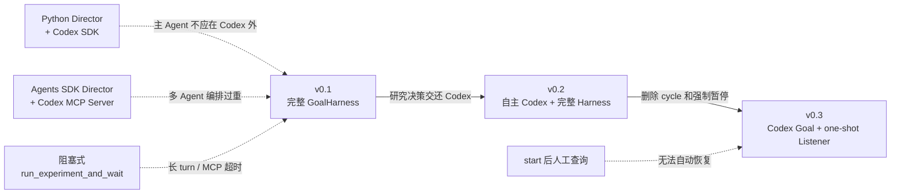

# 自动实验优化 Agent 历史方案

本文档保存已经讨论过、但不属于当前默认运行链路的设计。当前默认方案请阅读
[App Server Supervisor](AUTO_RESEARCH_SUPERVISOR_SCHEDULER_DESIGN.md)。Desktop Listener
的历史实现单独见 [Legacy Desktop Listener](LEGACY_DESKTOP_GOAL_WAKE_LISTENER.md)。

## 1. Python Director + Codex SDK

早期方案将 Python Director 作为主 Agent：Director 维护搜索状态、选择候选、分配 explore/exploit/replicate，并调用 Codex SDK thread 完成研究推理和代码修改。

```text
Python Director
    ↓
Codex SDK thread
    ↓
Local Runner / Watcher
    ↓
结果事件与 ledger
```

这个方案适合无 UI、需要完全由 Python 控制线程生命周期的场景。缺点是需要自行实现 Goal 管理、上下文恢复、结果分析 turn 和调度逻辑，不能直接复用 Codex Goal 的持续研究能力。

## 2. Agents SDK + Codex MCP Server

第二种方案由 Agents SDK 中的 Research Director 作为主 Agent，Codex 通过 MCP 作为 coding specialist。适合需要多个 specialist、trace、handoff 和 guardrail 的场景。此时 `/goal` 只是 Codex thread 的持久目标，不是外层 Agents SDK 的调度器。

```text
Agents SDK Research Director
    ↓ MCP
Codex MCP Server / Codex Thread
    ↓ shell / workspace
Local Runner
```

## 3. 外部 Watcher + Goal 暂停/恢复的早期评估

早期曾考虑由 Goal 启动后台实验，暂停 Goal，由 Watcher 监听完成事件，再恢复 Goal 并注入实验结果。当时因为会话绑定、幂等和恢复接口尚未验证，没有采用。v0.3 已验证 App Server 的 Goal API 和当前工具环境中的 thread id，最终以 one-shot Listener 形式采用了这一方向；现行细节见当前方案文档。

早期曾考虑由 Experiment MCP 提供 `run_experiment_and_wait`，在工具内部阻塞等待本地终态事件。该接口会让 Codex turn 长时间保持打开，已删除。v0.3 只让 `start_experiment` 返回 `run_id`，等待发生在 detached Listener 中。

## 4. 方案演进



实线表示实际代码版本演进；虚线表示评估过但未作为主版本发布的方案及其经验来源。

| 阶段 | 主调度者 | 实验执行方式 | 当前状态 |
|---|---|---|---|
| A | Python Director | Codex SDK + Runner | 仅保留设计记录，代码已删除 |
| B | Agents SDK Director | Codex MCP Server + Runner | 仅保留设计记录，未作为当前实现 |
| C | Harness 与 Codex 分担 | Experiment MCP + detached Worker + 完整 GoalHarness | v0.1，tag `v0.1.0` |
| D | Codex Goal | Experiment MCP + detached Worker + 完整 GoalHarness | v0.2，tag `v0.2.0` |
| E | Codex Goal | CLI/可选 MCP + detached Worker + one-shot Listener | v0.3 legacy，默认禁用 |

更完整的历史职责矩阵和长实验等待方式对比见
[Legacy Desktop Listener 的方案对比](LEGACY_DESKTOP_GOAL_WAKE_LISTENER.md#11-与历史架构方案对比)。
