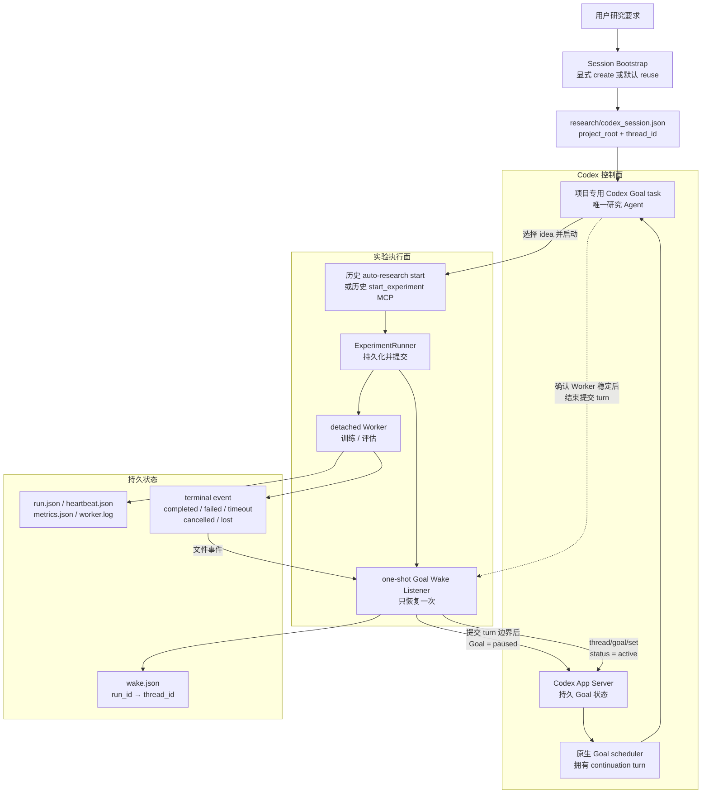
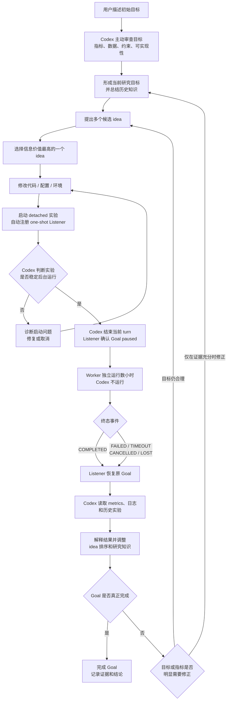
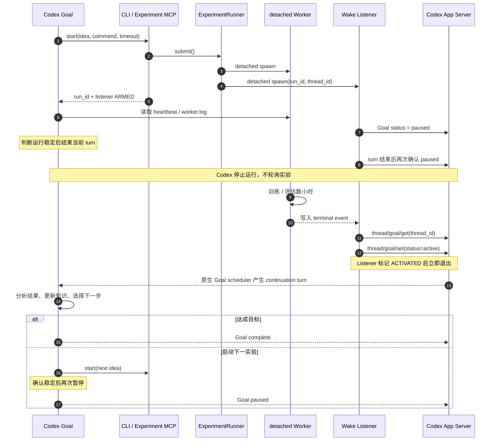
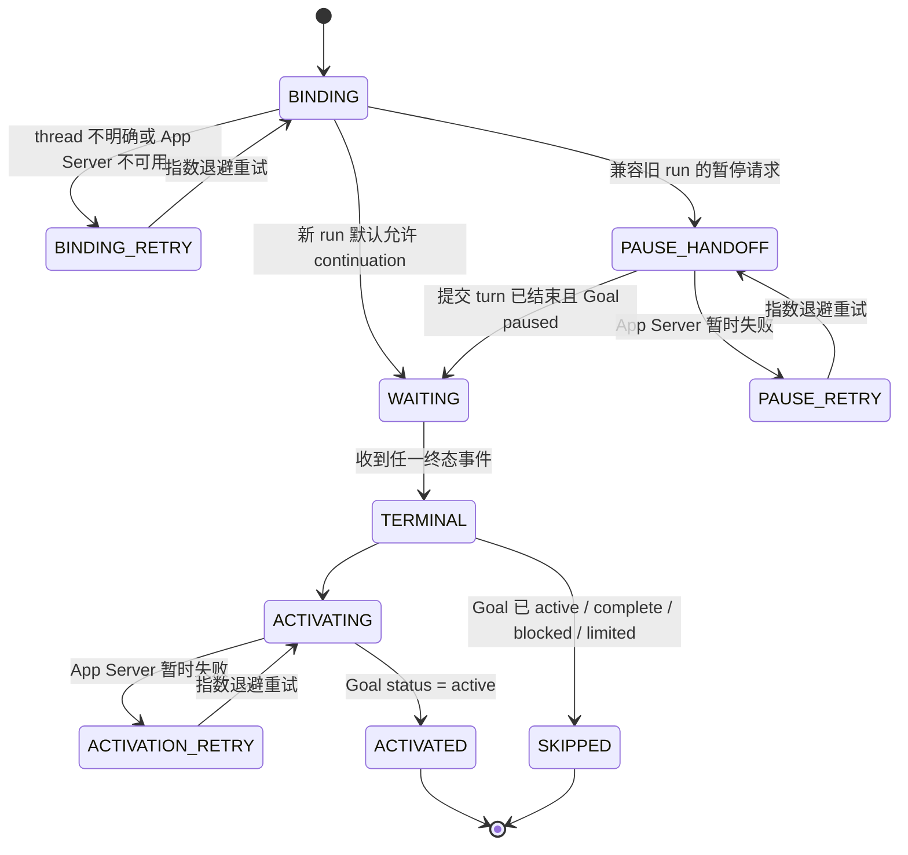

# Legacy v0.3：Desktop Goal + One-shot Wake Listener

> **Legacy compatibility only.** 本方案不属于 `main` 的默认运行链路，默认配置
> `listener.auto_wake=false`。新研究任务必须使用 managed App Server Supervisor；
> 只有维护既有 Desktop Goal 任务时才显式启用本 Listener。正式架构见
> [App Server Supervisor](AUTO_RESEARCH_SUPERVISOR_SCHEDULER_DESIGN.md)。

## 显式启用

仅对已有 Desktop Goal 任务，在项目配置中显式开启：

```toml
[listener]
auto_wake = true
```

新项目和 `auto-research init` 默认写入 `false`。main 已删除公开 MCP
`start_experiment`；本文后续出现的该名称和 `auto-research start` 都只描述历史 v0.3
行为，不是当前可用入口。`recover-wakes` 不会恢复禁用的历史 Listener，`arm-wake`
与 `recover-wakes` 命令均应视为 legacy 运维入口。

## 1. 设计目标

Codex Goal 保留完整研究自主权；外部代码只解决长实验与暂停 Goal 之间的异步断点。

核心原则：

1. Codex 决定研究内容；Listener 只在实验交接边界切换 paused/active。
2. Worker 独立于 Codex turn 执行。
3. Goal 暂停期间不运行模型、不查询 `RUNNING`。
4. 终态事件只触发一次对原 Goal 的恢复。
5. 不引入 Harness cycle、阶段编排或外部停止判断。

## 2. Legacy 架构图



图中的关键边界是：Codex 负责“为什么实验、实验什么、何时结束提交 turn、结果意味着什么”；Listener 只负责在该 turn 边界确认 paused，并在终态后让同一个 Goal task 再运行起来。

Session Bootstrap 只在研究开始前运行，不属于单次实验闭环。它负责创建或采用一个 `cwd` 精确绑定实验项目的持久 task；之后所有实验都复用该 task，Listener 仍然不会创建会话或 turn。

## 3. 组件边界

| 组件 | 负责 | 不负责 |
|---|---|---|
| Codex Goal | 目标优化、资料研究、idea、代码、实验解释与完成 | 后台进程保活、外部 turn 创建 |
| Session Bootstrap | 显式创建一次或采用现有 task、校验项目 cwd、命名、持久绑定 | 自动重复创建、启动研究 turn、实验调度 |
| CLI / Experiment MCP | 确定性提交、结果读取、取消 | 研究策略、Goal 状态 |
| ExperimentRunner | run 持久化、并发边界、detached Worker 启动 | 训练内容、idea 选择 |
| detached Worker | 执行命令、heartbeat、metrics、终态 | 唤醒 Codex |
| Goal Wake Listener | run/thread 绑定、在提交 turn 后确认 paused、等待终态、激活一次 Goal | cycle、idea、指标判断、turn 创建 |
| Codex App Server | 持久 Goal 状态更新 | 实验执行、Listener 自建 turn |

依赖方向保持单向：Codex 可以调用实验入口；实验执行层不调用研究策略；Listener 只通过 App Server 恢复 Codex。

### 3.1 专用会话的创建与复用

入口为：

```bash
auto-research session --project <root> --create-thread
```

语义如下：

1. `--create-thread` 只表示“缺失时创建”，不是“强制新建”。
2. 创建成功取得 `thread_id` 后，先原子写入 `research/codex_session.json`，再执行命名和 Goal 初始化；后续 RPC 失败时重试仍使用同一个 thread。
3. 文件锁覆盖读取、创建与写入事务，两个并发启动者最多只有一个能调用 `thread/start`。
4. 已有状态时调用 `thread/read`，要求 thread 的 `cwd` 与规范化项目根目录完全一致。
5. 状态文件损坏、项目不匹配或显式 thread 冲突时失败关闭，不把异常解释为“尚未创建”。
6. 新 task 的 Goal 默认设为 `paused`，Bootstrap 不调用 `turn/start`；首次研究 turn 由 Codex 桌面端或用户启动，避免再次形成空 active task。
7. 已有 task 可通过 `--thread-id` 采用；已有 Goal 默认保留，只有显式 `--objective --replace-goal` 才允许替换。

`research/codex_session.json` 是项目级唯一绑定，典型内容为：

```json
{
  "schema_version": 1,
  "project_root": "/absolute/path/to/project",
  "thread_id": "019f...",
  "title": "Auto Research · project",
  "objective": "...",
  "ownership": "auto_created",
  "setup_state": "ready"
}
```

实验提交时的 thread 解析顺序是：显式 `thread_id`、当前 `CODEX_THREAD_ID`、项目持久绑定。若当前 Codex task 与项目专用 task 不同，提交直接失败，而不是把实验绑定到另一个上下文。

## 4. 自动研究闭环流程图



失败终态也进入同一个闭环。实验被 kill、代码异常或缺少指标并不等于研究结束，而是交还 Codex 决定 repair、retry、换 idea 或停止。

## 5. 单次实验闭环时序图



Listener 不显式创建恢复 turn。它只提交一次持久 Goal 状态转换；原生 Goal scheduler 负责 continuation turn，因此桌面端、Listener 和独立 App Server 之间不会出现 writer 所有权竞争。

## 6. 运行状态与所有权



新 run 默认不由 Listener 暂停 Goal，也不打断实验期间的 continuation。Codex 完成
所有仍有价值的工作后，由当前 Desktop Goal Turn 原生进入 `blocked`；Listener 将其
视为实验等待态，并在终态后恢复为 `active`。`PAUSE_HANDOFF` 仅保留给已经落盘的旧
run 兼容恢复。独立 App Server 不读取 Desktop session JSONL，也不尝试跨宿主中断
Turn。

## 7. thread 绑定

绑定优先级：

1. `wake.json` 已持久化的 `thread_id`。
2. CLI/MCP 显式 `thread_id`。
3. 当前 Codex 工具环境的 `CODEX_THREAD_ID`，并通过 App Server 再验证。
4. `thread/list(cwd=<project>)` 中最近的 active/paused Goal。

在 Session Bootstrap 已配置的项目中，实验提交会预先把专用 `thread_id` 写入 run，Listener 通常不会走到第 4 级自动发现。自动发现仅作为未迁移项目的兼容恢复路径。

自动发现只接受与 run 创建时间接近的候选。多个候选时间相同或候选过旧时，Listener 保持 `BINDING_RETRY`，等待显式绑定，不采用“最新历史会话”猜测。

`run_id -> thread_id` 写入每个 run 的 `wake.json`，之后恢复不再重新选择任务。

## 8. 为什么 Listener 只激活 Goal，不启动 turn

官方 App Server 协议把 `thread/resume` 定义为重新打开已有 thread，把 `turn/start` 定义为启动生成；而桌面端本身已经是该 thread 的执行宿主。真实验证发现，Listener 再启动一个独立 App Server 并调用 `thread/resume` 会与桌面端争抢 writer，出现 `already has an active writer`。

因此 legacy Listener 只使用不创建新 turn、不接管 writer 的接口：

1. `thread/goal/get` 核对 Goal 与精确 thread 绑定。
2. 等待期间不改变 active Goal，也不观察或中断 Turn。
3. 当前宿主在只剩等待时原生写入 `blocked`。
4. 实验终态后再次读取 Goal；blocked 时设置为 active，已经 active 或已终止时不重复。
5. 写入 `ACTIVATED` 后退出。

模型、reasoning effort、sandbox、approval 和 continuation turn 都继承原 Goal task，由原生 Goal scheduler 管理；Listener 不再有模型配置和长 turn watchdog。

## 9. 幂等与竞态

每个 run 使用 `.wake-listener.lock` 保证只有一个 Listener。`wake.json` 记录：

- `thread_id`
- `state`
- `terminal_status`
- `activated_at`
- `pause_requested_at`
- `pause_boundary_observed_at`
- `attempts`
- `last_error`

激活前读取持久 Goal 状态：

- Goal 已 active：认为用户或原生调度器已接管，标记 `SKIPPED`。
- Goal blocked：视为显式实验等待，终态后激活。
- Goal complete/limited：不自动激活，标记 `SKIPPED`。
- Listener 在激活响应前断线：重启后重新核对 Goal/thread；已 active 的任务不会创建第二个 turn。
- `recover-wakes` 只恢复带有 `runtime_version=3` 和 `wake_enabled=true` 的 run，不接管 v0.1/v0.2 历史实验。

## 10. 失败模型

| 故障 | 行为 |
|---|---|
| 终端或 Codex turn 关闭 | Worker 和 Listener 均为 detached，不受影响 |
| 实验失败/超时/被 kill | 写终态或最终进入 LOST，然后照常唤醒 Goal |
| App Server 暂时不可用 | 本地指数退避重试，不调用模型 |
| Listener 崩溃/机器重启 | `recover-wakes` 从 run/wake 文件恢复 |
| thread 候选不明确 | 不猜测；持续 `BINDING_RETRY` 或显式 `--thread-id` |
| 重复终态文件事件 | 单实例锁和持久 `ACTIVATED` 状态阻止重复激活 |
| Goal 已被人工恢复 | thread active 时 Listener 跳过重复唤醒 |
| 实验期间产生 continuation | 正常行为；Listener 不暂停、不观察也不中断 |
| 只剩实验等待 | 当前宿主进入 blocked；Listener 在终态后恢复 active |

## 11. 与历史架构方案对比

### 11.1 主体职责对比

| 方案 | 主研究 Agent | 实验等待 | Goal 暂停 | Goal 恢复 | turn 推进 | 研究自由度 | 工程复杂度 | 结论 |
|---|---|---|---|---|---|---|---|---|
| Python Director + Codex SDK | Python Director | Director/Runner | 不使用原生 Goal | Director 创建 SDK run | Director | 中 | 高 | 适合无 UI、中心化编排，不符合本项目“Codex 是主 Agent”目标 |
| Agents SDK Director + Codex MCP Server | Agents SDK Director | 外层 Agent | 外层管理 | 外层管理 | 外层 handoff | 高但分散 | 最高 | 适合多 specialist 和 trace，本项目不需要第二个主 Agent |
| v0.1 完整 GoalHarness | Harness 与 Codex 分担 | Harness | Harness | Harness | Harness cycle | 较低 | 高 | 稳定性逻辑集中，但固定流程侵入研究决策 |
| v0.2 自主 Codex + 完整 Harness | Codex | Harness | Harness 强制 | Harness | Harness cycle | 高 | 高 | 研究自主性改善，但生命周期和状态机仍过重 |
| v0.3 one-shot Listener | Codex Goal | detached Listener | Agent 只剩等待时原生 blocked | Listener 只激活一次 | 原生 Goal scheduler | 最高 | 低 | Desktop 兼容方案，保留闭环所需的最小外部能力 |

### 11.2 长实验等待方式对比

| 等待方式 | 实验期间 Codex turn | 模型轮询 | 自动恢复 | 主要问题 | 是否采用 |
|---|---|---|---|---|---|
| `run_experiment_and_wait` 阻塞 MCP | 持续打开数小时 | 无 | 工具返回后继续 | MCP/turn 超时、连接断开、上下文长期占用 | 否 |
| Codex 循环查询 `get_result` | 持续产生 turn | 有 | 有 | 大量无意义 token，长时间研究成本高 | 否 |
| `start_experiment` 后结束 turn，人工后续查询 | 结束 | 无 | 无 | 无人触发后续 turn，闭环中断 | 否 |
| 完整 GoalHarness 等本地事件 | 结束 | 无 | 有 | 能闭环，但 Harness 状态机、cycle 和恢复逻辑复杂 | v0.1/v0.2 |
| continuation 后显式 blocked + detached Listener | 有效工作期间继续；纯等待时结束 | 无意义轮询为零 | 有 | 需要 Agent 正确声明纯等待点 | v0.3 Desktop 方案 |

### 11.3 为什么最终选择 v0.3

v0.3 保留了历史方案中真正必要的四项工程能力：

1. detached Worker，避免终端和 turn 断开杀死实验。
2. 持久终态事件，避免依赖内存消息。
3. `run_id -> thread_id` 精确绑定，避免唤醒历史会话。
4. App Server Goal 状态激活，避免模型轮询和外部 turn writer。

同时删除了不应由外部程序拥有的研究职责：idea 调度、cycle、目标完成判断、每轮 prompt 阶段和自动修改 Goal。

## 12. 被删除的 v0.2 职责

v0.3 不再包含：

- `GoalHarness`
- `max_cycles`
- `active_harness_cycle.json`
- 每 cycle 一个实验的控制器约束
- Harness 自动暂停 Goal
- Harness 对目标完成、连续失败、plateau 的判断
- `goal_contract.json` / `goal_decision.json` 格式修复 turn

实验预算和硬指标仍可写在 `goal.json`，由 Codex Goal 判断。Runner 仅在 run 中保留目标快照用于追溯，不把它升级为外部研究流程。

## 13. 代码映射

| 能力 | 文件 |
|---|---|
| CLI | `src/auto_research/cli.py` |
| 项目专用会话 | `src/auto_research/research_session.py` |
| 配置 | `src/auto_research/config.py` |
| detached Runner | `src/auto_research/runner.py` |
| Worker | `src/auto_research/runner_worker.py` |
| Wake Listener | `src/auto_research/wake_listener.py` |
| App Server 最小客户端 | `src/auto_research/app_server.py` |
| 可选 MCP | `src/auto_research/mcp_server.py` |

## 14. 验收标准

1. `start` 立即返回 run id，Worker 和 Listener 都脱离当前终端。
2. 当前 Codex thread id 被持久化，不会绑定历史 Goal。
3. 实验运行数小时期间没有 Codex turn 或 MCP 状态轮询。
4. 提交 turn 结束后有持久 `pause_boundary_observed_at`，实验期间 Goal 保持 paused。
5. 所有终态都会触发一次 Goal 激活，包括失败和 LOST。
6. 激活后是同一个 thread，Listener 不创建新研究会话或 turn。
7. `thread/goal/set(active)` 成功后 Listener 自动退出，由原生 Goal scheduler 继续。
8. Listener/App Server 中断后可通过 `recover-wakes` 恢复且不重复激活 Goal。
9. 同一项目重复执行 `session --create-thread` 只产生一个 thread；状态损坏、cwd 不符和并发创建均不能产生静默副本。
